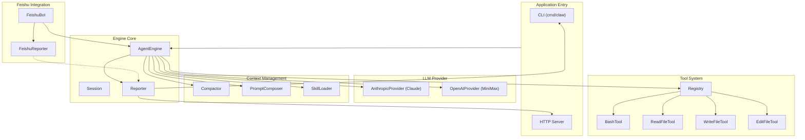

# go-my-harness Overview

## Purpose
`go-my-harness` is a modular Go framework for building AI-powered conversational agents. It provides a harness that integrates multiple large language model (LLM) providers, manages conversation context and skills, offers a tool-execution system, and can be embedded in different application entry points (CLI, server, or messaging platforms like Feishu/Lark). The project emphasizes reusability and separation of concerns, enabling developers to assemble custom agents with minimal boilerplate.

## End-to-End Architecture

**Flow Description:**
1. **Application Entry** (CLI or HTTP server, optionally Feishu bot) creates an `AgentEngine`.
2. The **Engine Core** orchestrates interactions: it builds prompts using the **Context Management** module, sends them to the configured **LLM Provider**, and handles responses.
3. If the LLM requests tool execution, the engine invokes the **Tool System** (bash, file I/O, editing) via the registry.
4. All events (thoughts, messages, tool calls/results) are streamed through a **Reporter** interface, which can output to terminal or forward to a Feishu channel via `FeishuReporter`.
5. The **Feishu Integration** provides a WebSocket-based bot that receives user messages and dispatches them to the engine, then returns results using its own reporter.

## Core Modules

- **LLM Provider** (`internal/provider`)  
  Abstracts LLM API calls (Claude, OpenAI/MiniMax) behind a common `LLMProvider` interface. Configuration loading (including Feishu settings) is handled here.

- **Context Management** (`internal/context`)  
  Manages conversation history compaction, prompt composition (system prompt + skills + conversation), and dynamic loading of skill definitions from markdown files.

- **Tool System** (`internal/tools`)  
  A pluggable tool registry with built-in tools for bash execution, file reading/writing, and file editing. Each tool exposes a definition and an execution method.

- **Engine Core** (`internal/engine`)  
  The central agent loop, session management (in-memory), and reporter abstraction. The `AgentEngine.Run` method coordinates LLM calls, tool execution, and event reporting.

- **Feishu Integration** (`internal/feishu`)  
  Implements a Feishu/Lark bot using the Feishu WebSocket SDK. It includes a custom reporter that formats engine events and sends them to Feishu chat.

For detailed API and usage, refer to the source files within each package.