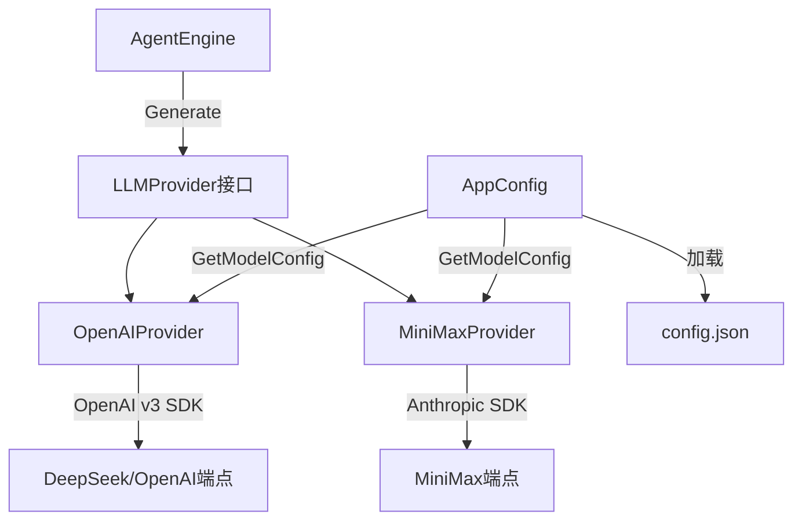

# LLM提供者

## 模块简介

LLM 提供者模块定义了与大模型通信的统一契约，并提供了具体的适配器实现。采用**策略模式**，通过 `LLMProvider` 接口抽象推理调用，引擎无需关心底层是 OpenAI、DeepSeek 还是 MiniMax，只需调用 `Generate` 方法即可。

同时包含应用配置加载（`config.json`），支持多模型切换和飞书机器人配置。

## 架构图



## 核心组件

### LLMProvider 接口

```go
type LLMProvider interface {
    Generate(ctx context.Context, messages []schema.Message,
             availableTools []schema.ToolDefinition) (*schema.Message, error)
}
```

统一契约：接收上下文历史 + 可用工具列表，返回一条 Assistant 消息（可能包含 ToolCalls）。

### [OpenAIProvider](../../../internal/provider/openpi.go)

基于 OpenAI Go SDK v3，指向 OpenAI 兼容端点（如 DeepSeek）。核心职责是**双向翻译**：

- **入向**：将内部 `schema.Message` 翻译为 OpenAI SDK 的消息格式（System/User/Assistant/Tool）
- **出向**：将 API Response 反向翻译为内部 `schema.Message`

关键细节：历史中的 ToolCalls 必须原样放回（维系逻辑链），否则 API 会报错。慢思考模式下，Thinking 阶段不挂载 Tools（`availableTools` 为 nil）。

### [MiniMaxProvider](../../../internal/provider/claude.go)

基于 Anthropic SDK 的 MiniMax 适配器，结构与 [OpenAIProvider](../../../internal/provider/openpi.go) 类似，处理 Anthropic 特有的消息格式转换。

### [AppConfig](../../../internal/provider/config.go)（应用配置）

从 `config.json` 加载全局配置：

```go
type AppConfig struct {
    DefaultModel string
    Models       map[string]ModelConfig
    Feishu       *FeishuConfig
}
```

`ModelConfig` 包含 APIKey、BaseURL、Provider 类型。`LoadConfig` 支持相对路径解析（先查 CWD，再查可执行文件目录）。

## 交叉引用

- [引擎核心](引擎核心.md)：[AgentEngine](../../../internal/engine/loop.go) 通过 LLMProvider 接口调用大模型
- [飞书集成](飞书集成.md)：[FeishuConfig](../../../internal/provider/config.go) 从 [AppConfig](../../../internal/provider/config.go) 中获取
- [应用入口](应用入口.md)：main 函数中加载配置并实例化 Provider


<!-- crosslinks (auto-generated) -->
## Related Modules
- Used by: [应用入口](应用入口.md), [引擎核心](引擎核心.md)
