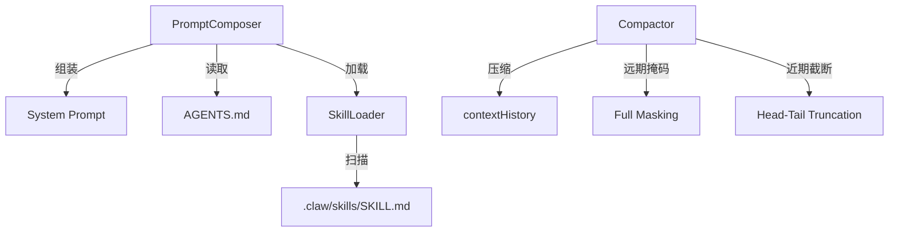

# 上下文管理

## 模块简介

上下文管理模块负责 Agent 的"大脑内存管理"——在有限的上下文窗口内最大化有效信息密度。包含三个核心能力：System Prompt 动态组装（[PromptComposer](../../../internal/context/composer.go)）、上下文压缩防 OOM（[Compactor](../../../internal/context/compactor.go)）、以及技能外挂加载（[SkillLoader](../../../internal/context/skill.go)）。

## 架构图



## 核心组件

### [PromptComposer](../../../internal/context/composer.go)（提示词组装器）

根据工作区环境动态生成 System Prompt，三层结构：

1. **极简内核**：基本身份 + 底线纪律（6 条核心规则）
2. **外部化状态**：加载工作区下的 `AGENTS.md` 作为项目专属规范
3. **技能外挂**：通过 [SkillLoader](../../../internal/context/skill.go) 动态注入 `.claw/skills/` 下的专业技能

每次 Run 时根据 [Session](../../../internal/engine/session.go) 的 WorkDir 重新组装，确保不同工作区获得不同的上下文。

### [Compactor](../../../internal/context/compactor.go)（上下文压缩器）

防止发往大模型的上下文 OOM 的核心防线。当总字符数超过水位线（默认 3000）时触发双重降级：

```go
type Compactor struct {
    MaxChars       int // 触发压缩的阈值
    RetainLastMsgs int // Working Memory 保护区大小
}
```

**压缩策略：**

- **远期历史区**（保护区之外）：工具输出执行 Full Masking（替换为长度摘要），模型推理折叠为一句话
- **短期保护区**（最近 N 条）：超长内容执行 Head-Tail Truncation（保留前 500 + 后 500 字符）
- **不可触碰**：System Prompt 和 ToolCalls 结构永远保留（维系逻辑链）

### [SkillLoader](../../../internal/context/skill.go)（技能加载器）

从 `.claw/skills/` 目录递归扫描所有 `SKILL.md` 文件，解析 YAML Frontmatter（name + description），将技能结构化为"触发条件 + 执行指南"格式注入 System Prompt。

```go
type Skill struct {
    Name        string
    Description string
    Body        string
}
```

## 交叉引用

- [引擎核心](引擎核心.md)：[AgentEngine](../../../internal/engine/loop.go) 在每轮循环中调用 Composer 和 [Compactor](../../../internal/context/compactor.go)
- [应用入口](应用入口.md)：工作区目录结构决定了 AGENTS.md 和 skills 的位置


<!-- crosslinks (auto-generated) -->
## Related Modules
- Depends on: [工具系统](工具系统.md)
- Used by: [引擎核心](引擎核心.md), [飞书集成](飞书集成.md)
