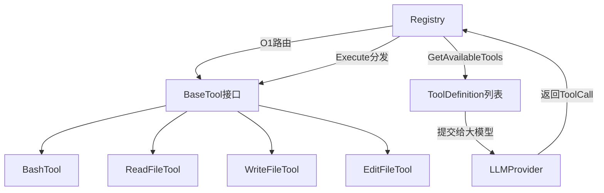

# 工具系统

## 模块简介

工具系统实现了 Agent 的"手和脚"——通过标准化的工具注册、发现和路由机制，让大模型能够与外部世界交互。采用**接口驱动 + 注册表模式**，新增工具只需实现 `BaseTool` 接口并注册到 `Registry` 即可被大模型自动发现和调用。

## 架构图



## 核心组件

### [BaseTool](../../../internal/tools/registry.go) 接口

所有工具必须实现的契约：

```go
type BaseTool interface {
    Name() string                              // 全局唯一名称
    Definition() schema.ToolDefinition         // JSON Schema 元信息
    Execute(ctx context.Context, args json.RawMessage) (string, error)
}
```

参数以 `json.RawMessage` 传入，反序列化由各工具内部自行处理，实现了工具间的解耦。

### [Registry](../../../internal/tools/registry.go)（工具注册表）

`Registry` 接口定义了工具的注册与分发：

- `Register(tool)` — 挂载工具，以 Name 为 Key 存入 map（O(1) 路由）
- `GetAvailableTools()` — 返回所有工具的 Schema 列表，供 Main Loop 交给 Provider
- `Execute(ctx, call)` — 路由并执行模型请求的工具调用

当模型调用不存在的工具时（幻觉），[Registry](../../../internal/tools/registry.go) 返回错误信息而非 panic，利用大模型的自纠错能力自行修正。

### [BashTool](../../../internal/tools/bash.go)（命令执行）

在工作区内执行任意 bash/powershell 命令，内置四道驾驭防线：

1. **时间预算**：30 秒超时强制终止，防止卡死进程
2. **工作区绑定**：命令在 [Session](../../../internal/engine/session.go) 指定的 WorkDir 下执行
3. **错误原样回传**：bash 报错不返回 Go error，而是拼接输出让模型自行分析（Self-Correction）
4. **长度截断**：输出超过 8000 字节时截断，防 OOM

跨平台支持：Windows 使用 PowerShell，macOS/Linux 使用 bash。

### [EditFileTool](../../../internal/tools/edit_file.go)（文件编辑）

对现有文件进行局部字符串替换，实现了四级模糊匹配策略：

1. **L1 精确匹配**：直接字符串替换
2. **L2 换行符统一**：\r\n → \n 后再匹配
3. **L3 去首尾空白**：TrimSpace 后匹配
4. **L4 逐行模糊**：每行去缩进后逐行对比

每级匹配都要求唯一性，多处匹配时返回错误提示模型提供更多上下文。

### [ReadFileTool](../../../internal/tools/read_file.go) / [WriteFileTool](../../../internal/tools/write_file.go)

标准的文件读写工具，均绑定 WorkDir 进行路径约束，防止越权访问。

## 交叉引用

- [引擎核心](引擎核心.md)：[AgentEngine](../../../internal/engine/loop.go) 通过 [Registry](../../../internal/tools/registry.go) 接口执行工具调用
- [应用入口](应用入口.md)：main 函数中注册所有内置工具


<!-- crosslinks (auto-generated) -->
## Related Modules
- Used by: [上下文管理](上下文管理.md), [应用入口](应用入口.md), [引擎核心](引擎核心.md)
