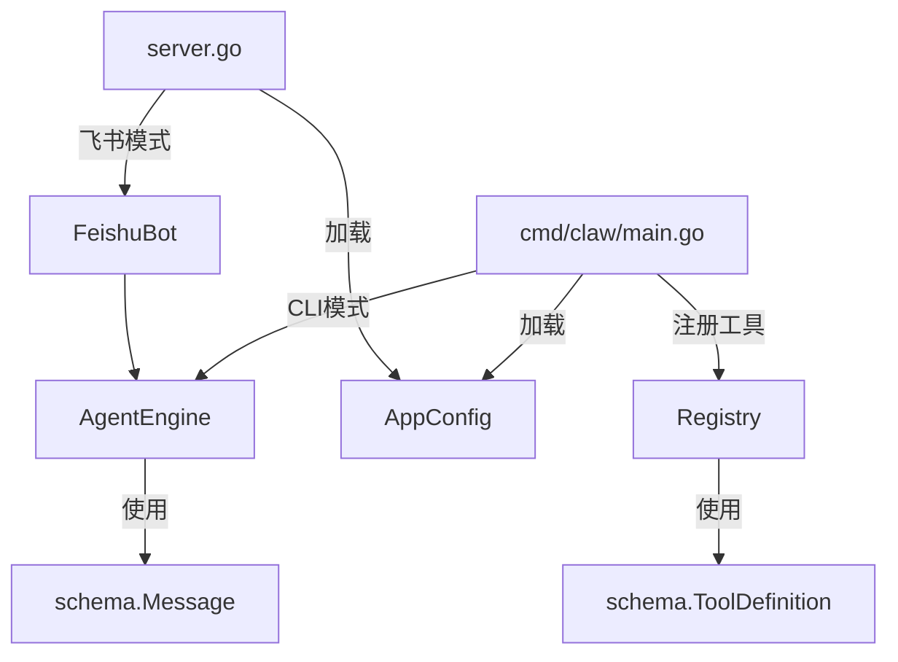

# 应用入口

## 模块简介

应用入口模块包含程序的启动逻辑和全局数据模型定义。提供两种运行模式：CLI 终端模式（`cmd/claw/main.go`）和飞书服务模式（`server.go`）。同时定义了贯穿全系统的数据契约（`internal/schema`）。

## 架构图



## 核心组件

### CLI 入口（cmd/claw/main.go）

终端交互模式的启动流程：

1. 加载 `config.json` 配置
2. 根据 provider 类型实例化 LLMProvider
3. 创建 [Registry](../../../internal/tools/registry.go) 并注册内置工具（bash、read_file、write_file、edit_file）
4. 创建 [AgentEngine](../../../internal/engine/loop.go)
5. 进入 REPL 循环：读取用户输入 → 创建/复用 [Session](../../../internal/engine/session.go) → 调用 Engine.Run → 输出结果

### 飞书服务入口（server.go）

飞书机器人模式的启动流程：

1. 加载配置，实例化 Provider 和 Engine
2. 创建 [FeishuBot](../../../internal/feishu/bot.go)
3. 调用 `StartWebSocket` 进入长连接监听（阻塞）

### schema 数据模型

`internal/schema/message.go` 定义了贯穿全系统的核心数据结构：

```go
type Message struct {
    Role       string          // system / user / assistant
    Content    string
    ToolCalls  []ToolCall      // 模型发起的工具调用
    ToolCallID string          // 工具响应对应的调用 ID
}

type ToolCall struct {
    ID        string
    Name      string
    Arguments json.RawMessage
}

type ToolResult struct {
    ToolCallID string
    Output     string
    IsError    bool
}

type ToolDefinition struct {
    Name        string
    Description string
    InputSchema interface{}
}
```

这些结构是引擎、工具、提供者之间的通用语言，实现了模块间的解耦。

## 交叉引用

- [引擎核心](引擎核心.md)：入口函数创建并启动 [AgentEngine](../../../internal/engine/loop.go)
- [工具系统](工具系统.md)：入口函数注册所有内置工具
- [LLM提供者](LLM提供者.md)：入口函数加载配置并实例化 Provider
- [飞书集成](飞书集成.md)：server.go 创建 [FeishuBot](../../../internal/feishu/bot.go) 并启动 WebSocket


<!-- crosslinks (auto-generated) -->
## Related Modules
- Depends on: [LLM提供者](llm提供者.md), [工具系统](工具系统.md), [引擎核心](引擎核心.md)
- Used by: [引擎核心](引擎核心.md)
