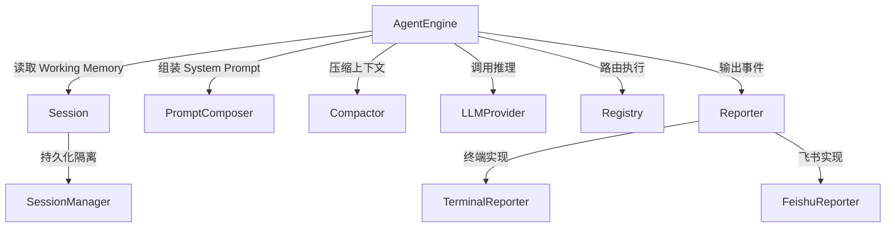

# 引擎核心

## 模块简介

引擎核心是 go-my-harness 的心脏，实现了 Agent 的主循环（Main Loop）驱动逻辑。它采用**无状态引擎 + 有状态 [Session](../../../internal/engine/session.go)** 的架构：`AgentEngine` 本身不持有任何会话状态，而是通过传入的 `Session` 实例承载上下文，从而实现多端并发下的物理隔离。

核心设计理念是"驾驭工程"（Harness Engineering）——通过 Working Memory 截取、上下文压缩、并发工具执行等机制，确保大模型在有限上下文窗口内高效运行。

## 架构图



## 核心组件

### [AgentEngine](../../../internal/engine/loop.go)（主循环引擎）

`AgentEngine` 是 Agent 的核心驱动器，负责执行 Think → Act → Observe 循环：

```go
type AgentEngine struct {
    provider       provider.LLMProvider
    registry       tools.Registry
    EnableThinking bool
    composer       *ctxpkg.PromptComposer
    compactor      *ctxpkg.Compactor
}
```

**Run 方法的执行流程：**

1. 根据 [Session](../../../internal/engine/session.go) 绑定的 WorkDir 动态组装 System Prompt
2. 进入主循环：截取 Working Memory → 压缩上下文 → 调用 LLM
3. Phase 1（可选）：慢思考模式，先让模型进行 Reasoning
4. Phase 2：Action 阶段，模型决定是否调用工具
5. 若无 ToolCalls → 退出循环（任务完成）
6. 若有 ToolCalls → 并发执行所有工具 → 结果追加回 [Session](../../../internal/engine/session.go) → 继续循环

关键设计：工具执行使用 `sync.WaitGroup` 并发，多个工具调用同时执行，结果按原始顺序写回。

### [Session](../../../internal/engine/session.go)（会话状态）

`Session` 是一次持续人机交互的承载体，维护完整的消息历史：

```go
type Session struct {
    ID        string
    WorkDir   string
    history   []schema.Message
    mu        sync.RWMutex
}
```

**GetWorkingMemory** 是驾驭工程的核心方法——不返回全量历史，而是从后往前截取最近 N 条消息作为"短期工作记忆"。同时处理"孤儿 [ToolResult](../../../internal/schema/message.go)"问题：如果截断点恰好落在一个 [ToolResult](../../../internal/schema/message.go) 上（其对应的 [ToolCall](../../../internal/schema/message.go) 已被截断），则自动跳过，避免大模型 API 报 400 错误。

### [SessionManager](../../../internal/engine/session.go)（全局会话管理器）

`SessionManager` 提供多用户/多终端的 [Session](../../../internal/engine/session.go) 隔离，以 map + 读写锁实现线程安全的 GetOrCreate 语义。飞书场景下以 ChatID 作为 SessionID，不同群聊各自独立。

### [Reporter](../../../internal/engine/reporter.go)（输出抽象接口）

```go
type Reporter interface {
    OnThinking(ctx context.Context)
    OnToolCall(ctx context.Context, toolName string, args string)
    OnToolResult(ctx context.Context, toolName string, result string, isError bool)
    OnMessage(ctx context.Context, content string)
}
```

[Reporter](../../../internal/engine/reporter.go) 将引擎的输出事件抽象为统一接口，使得引擎可以无缝切换终端（CLI）、飞书、WebUI 等不同展现层。

### [TerminalReporter](../../../internal/engine/terminal_repoter.go)（终端输出实现）

在 CLI 模式下将引擎事件格式化输出到终端，包括思考提示、工具调用日志、执行结果和最终回答。

## 交叉引用

- [工具系统](工具系统.md)：引擎通过 [Registry](../../../internal/tools/registry.go) 接口路由和执行工具调用
- [上下文管理](上下文管理.md)：引擎使用 [PromptComposer](../../../internal/context/composer.go) 和 [Compactor](../../../internal/context/compactor.go) 管理上下文
- [LLM提供者](LLM提供者.md)：引擎通过 LLMProvider 接口调用大模型推理
- [飞书集成](飞书集成.md)：[FeishuReporter](../../../internal/feishu/bot.go) 是 [Reporter](../../../internal/engine/reporter.go) 接口的飞书实现


<!-- crosslinks (auto-generated) -->
## Related Modules
- Depends on: [LLM提供者](llm提供者.md), [上下文管理](上下文管理.md), [工具系统](工具系统.md), [应用入口](应用入口.md)
- Used by: [应用入口](应用入口.md), [飞书集成](飞书集成.md)
