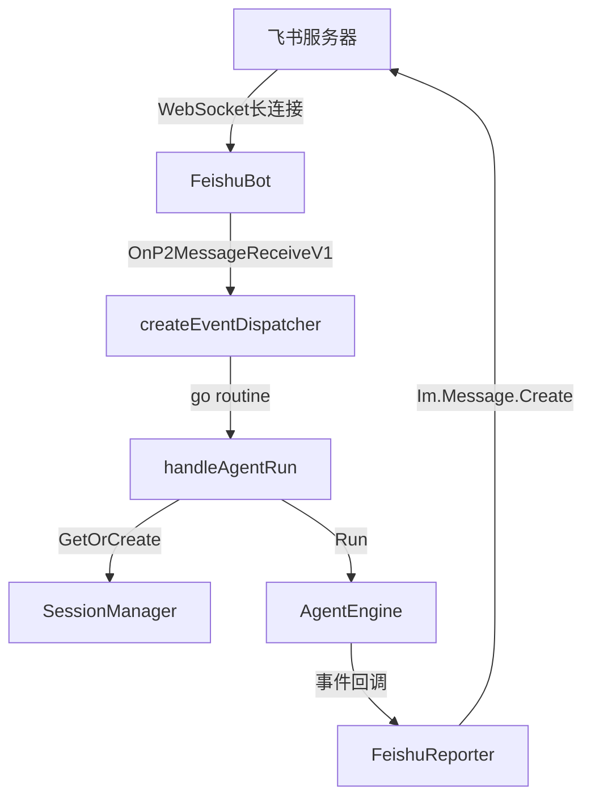

# 飞书集成

## 模块简介

飞书集成模块将 Agent 引擎接入飞书即时通讯平台，实现了"在群聊中@机器人即可触发 Agent 执行任务"的交互模式。采用 **WebSocket 长连接**接收事件（无需公网 IP），以 ChatID 作为 [Session](../../../internal/engine/session.go) 隔离键，不同群聊各自独立运行。

## 架构图



## 核心组件

### [FeishuBot](../../../internal/feishu/bot.go)（机器人主体）

```go
type FeishuBot struct {
    client      *lark.Client
    appID, appSecret, encryptKey, verifyToken string
    engine      *engine.AgentEngine
    workDir     string
}
```

**StartWebSocket**：启动 WebSocket 长连接模式（推荐），无需公网 IP、自动重连。创建事件调度器后调用 `wsClient.Start(ctx)` 阻塞运行。

**createEventDispatcher**：构建事件调度器，监听 `P2MessageReceiveV1` 事件。收到消息后提取文本内容，开启独立 Goroutine 执行 Agent 任务（绝不阻塞回调）。

**handleAgentRun**：连接飞书与引擎的桥梁——以 ChatID 为 SessionID 获取/创建 [Session](../../../internal/engine/session.go)，追加用户消息，启动引擎 Run。

### [FeishuReporter](../../../internal/feishu/bot.go)（飞书输出实现）

实现 `engine.Reporter` 接口，将引擎事件转化为飞书消息：

- `OnThinking` → 发送"🤔 模型正在慢思考"提示
- `OnToolCall` → 发送工具名称和参数
- `OnToolResult` → 成功/失败简报（不刷全量日志）
- `OnMessage` → 发送模型最终回答

通过飞书 OpenAPI `Im.Message.Create` 发送文本消息到指定 ChatID。

## 设计要点

- **并发安全**：每条飞书消息触发独立 Goroutine，[Session](../../../internal/engine/session.go) 内部用读写锁保护
- **物理隔离**：ChatID → SessionID 映射，不同群聊的 Agent 互不干扰
- **轻量反馈**：工具执行成功时仅汇报状态，避免飞书刷屏

## 交叉引用

- [引擎核心](引擎核心.md)：[FeishuBot](../../../internal/feishu/bot.go) 持有 [AgentEngine](../../../internal/engine/loop.go) 引用，[FeishuReporter](../../../internal/feishu/bot.go) 实现 [Reporter](../../../internal/engine/reporter.go) 接口
- [LLM提供者](LLM提供者.md)：[FeishuConfig](../../../internal/provider/config.go) 从 [AppConfig](../../../internal/provider/config.go) 中加载


<!-- crosslinks (auto-generated) -->
## Related Modules
- Depends on: [上下文管理](上下文管理.md), [引擎核心](引擎核心.md)
