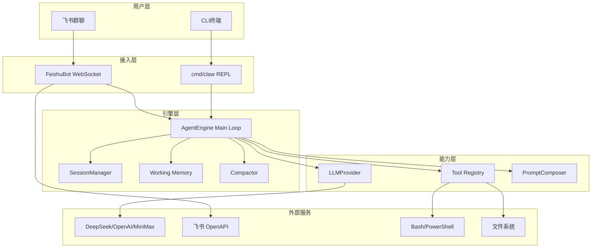

# go-my-harness

## 项目简介

go-my-harness 是一个用 Go 语言实现的 AI Agent 框架，核心理念是"驾驭工程"（Harness Engineering）——通过 Working Memory 截取、上下文压缩、并发工具执行、错误自愈等机制，让大模型在有限上下文窗口内高效、安全地完成研发任务。

项目支持两种运行模式：CLI 终端交互和飞书群聊机器人，通过 [Reporter](../../internal/engine/reporter.go) 接口抽象实现展现层与引擎的完全解耦。

## 端到端架构

## 模块总览

| 模块 | 职责 | 核心组件 |
|------|------|----------|
| [引擎核心](modules/引擎核心.md) | Agent 主循环、[Session](../../internal/engine/session.go) 管理、[Reporter](../../internal/engine/reporter.go) 抽象 | [AgentEngine](../../internal/engine/loop.go), [Session](../../internal/engine/session.go), [SessionManager](../../internal/engine/session.go) |
| [工具系统](modules/工具系统.md) | 工具注册、路由、执行 | [Registry](../../internal/tools/registry.go), [BashTool](../../internal/tools/bash.go), [EditFileTool](../../internal/tools/edit_file.go) |
| [上下文管理](modules/上下文管理.md) | System Prompt 组装、上下文压缩、技能加载 | [PromptComposer](../../internal/context/composer.go), [Compactor](../../internal/context/compactor.go), [SkillLoader](../../internal/context/skill.go) |
| [LLM提供者](modules/LLM提供者.md) | 大模型通信适配、配置加载 | LLMProvider, [OpenAIProvider](../../internal/provider/openpi.go), [AppConfig](../../internal/provider/config.go) |
| [飞书集成](modules/飞书集成.md) | 飞书机器人接入、消息收发 | [FeishuBot](../../internal/feishu/bot.go), [FeishuReporter](../../internal/feishu/bot.go) |
| [应用入口](modules/应用入口.md) | 启动逻辑、数据模型定义 | main, schema.[Message](../../internal/schema/message.go) |

## 技术栈

- 语言：Go 1.21+
- LLM SDK：openai-go v3（OpenAI 兼容端点）
- 飞书 SDK：oapi-sdk-go v3（WebSocket 长连接）
- 并发模型：Goroutine + WaitGroup（工具并发执行）、sync.RWMutex（[Session](../../internal/engine/session.go) 线程安全）

## 驾驭工程核心机制

1. **Working Memory 截取**：不发送全量历史，只取最近 N 条作为短期记忆
2. **双重压缩防线**：远期历史 Full Masking + 近期超长 Head-Tail Truncation
3. **孤儿 [ToolResult](../../internal/schema/message.go) 修复**：截断点落在工具响应时自动跳过，避免 API 400
4. **错误自愈**：工具报错不中断程序，原样回传让模型自行修正
5. **时间预算**：Bash 命令 30s 超时强制终止
6. **输出截断**：超长工具输出截断至 8000 字节防 OOM
