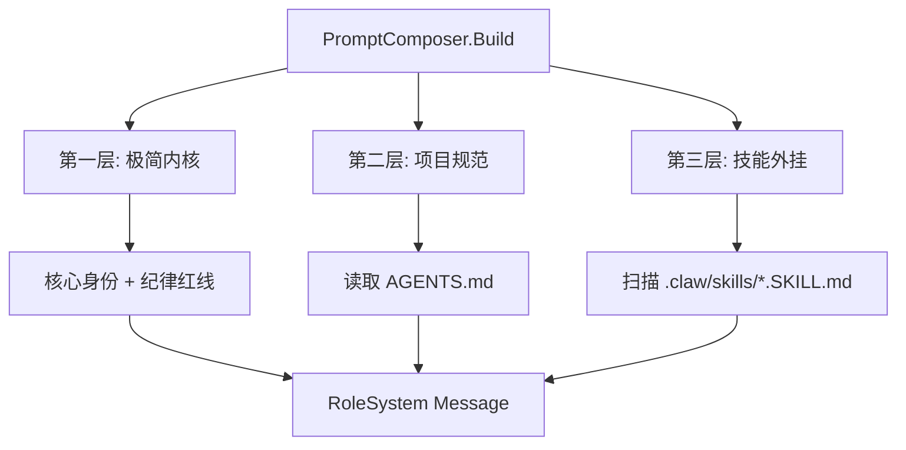
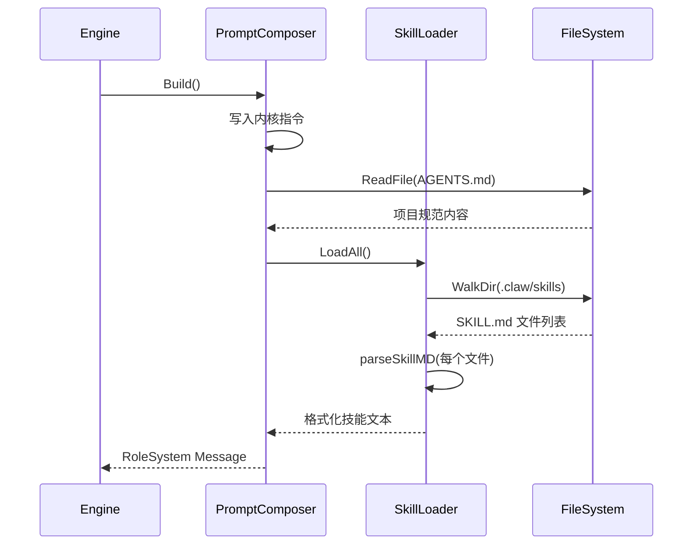

# Prompt上下文

Prompt上下文模块负责动态组装 Agent 的 System Prompt。它将极简内核指令、项目专属规范和外部技能模板三层内容融合为一条完整的系统消息，使 Agent 能够适应不同的工作区和技能配置。

## 组件概览

| 组件 | 类型 | 职责 |
|------|------|------|
| [PromptComposer](../internal/context/composer.go) | struct | 组装器主体，协调三层内容拼接 |
| [Skill](../internal/context/skill.go) | struct | 标准化技能结构，包含名称、描述和正文 |
| [SkillLoader](../internal/context/skill.go) | struct | 技能加载器，扫描并解析 .claw/skills 目录 |
| parseSkillMD | function | 解析 YAML Frontmatter 格式的 SKILL.md 文件 |

## 三层 Prompt 架构



## [PromptComposer](../internal/context/composer.go) 组装流程

[PromptComposer](../internal/context/composer.go) 在 `Build()` 方法中按固定顺序组装三层内容：

### 第一层：极简内核 (Minimal Core)

硬编码在代码中的核心指令，确立 Agent 的基本身份和纪律红线。包括：

- Agent 身份定义（"go-my-harness，驾驭工程驱动的码神助手"）
- 六条核心纪律，覆盖工具使用规范、文件操作准则和错误处理策略
- 中文回复要求

### 第二层：项目专属规范 (AGENTS.md)

从工作区根目录读取 `AGENTS.md` 文件内容，注入到 System Prompt 中。这一层是用户可编辑的外部化状态，用于定义项目特有的架构规范和注意事项。

如果 AGENTS.md 不存在，静默跳过，不影响引擎启动。

### 第三层：技能外挂 (Skills)

通过 [SkillLoader](../internal/context/skill.go) 动态加载工作区中的技能模板。技能目录结构：

```
.crawl/skills/
  └── <skill-name>/
      └── SKILL.md
```

每个 SKILL.md 使用 YAML Frontmatter 格式：

```yaml
---
name: skill-name
description: 触发条件描述
---

技能执行指南正文...
```

## [SkillLoader](../internal/context/skill.go) 加载机制

[SkillLoader](../internal/context/skill.go) 使用 `filepath.WalkDir` 递归扫描 `.claw/skills` 目录，查找所有名为 `SKILL.md` 的文件。

### 解析流程

`parseSkillMD` 函数实现了极简的 YAML Frontmatter 解析：

1. 检查文件是否以 `---\n` 开头
2. 使用 `---` 分割为三部分：前导、Frontmatter、正文
3. 逐行提取 `name:` 和 `description:` 字段
4. 正文部分作为技能的执行指南

解析结果格式化为统一的 Markdown 结构，包含技能名称、触发条件和执行指南。

### 容错策略

- 技能目录不存在时返回空字符串
- 文件读取失败时静默跳过
- 解析失败时使用默认值（"Unknown [Skill](../internal/context/skill.go)"）
- 总内容少于 100 字符时视为无效，返回空字符串

## 组件交互



## 模块依赖

- [数据模型](Schema.md) — 使用 [Message](../internal/schema/message.go) 和 Role 类型
- [Agent引擎](Engine.md) — 被 [AgentEngine](../internal/engine/loop.go) 持有并调用