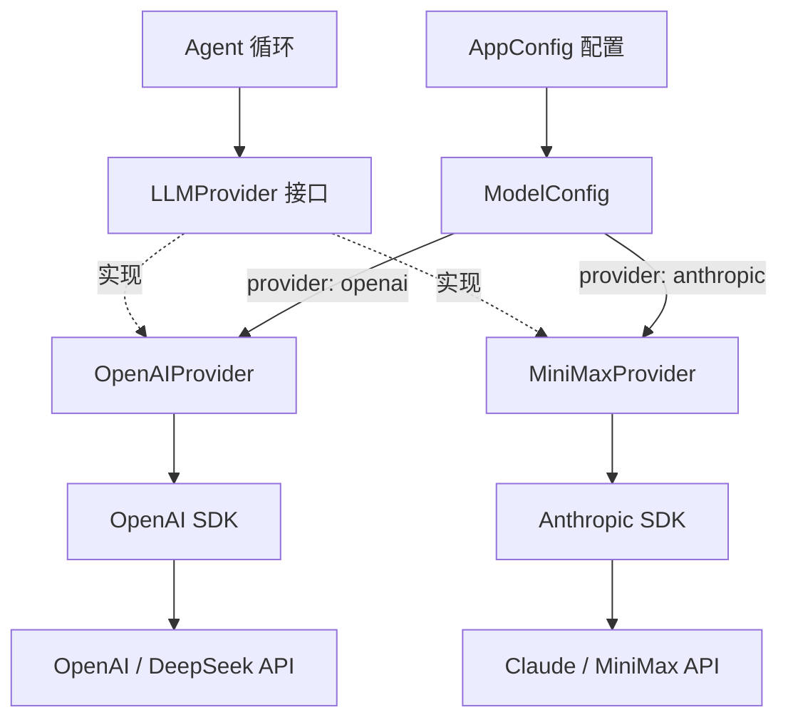
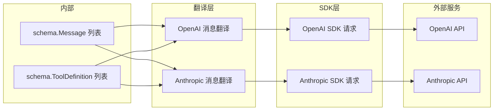
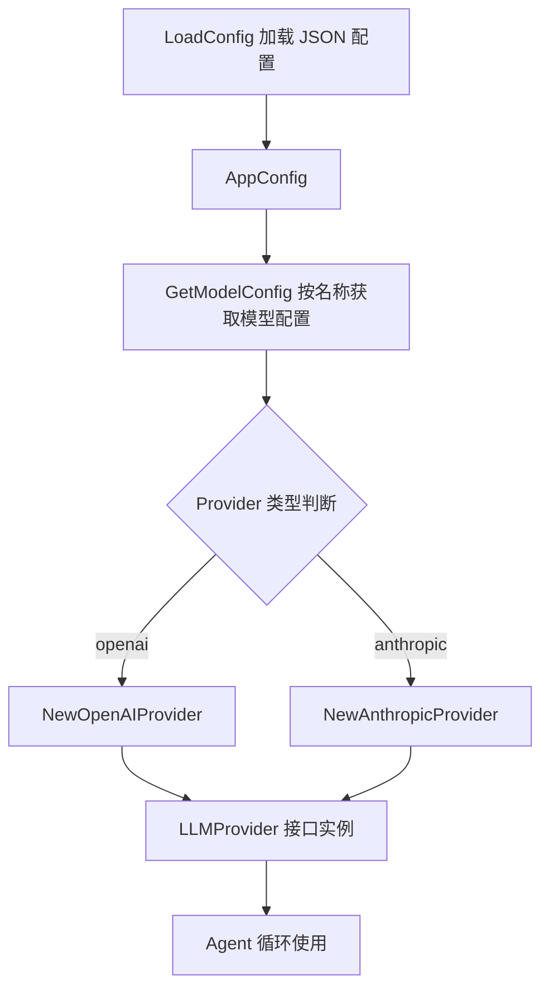
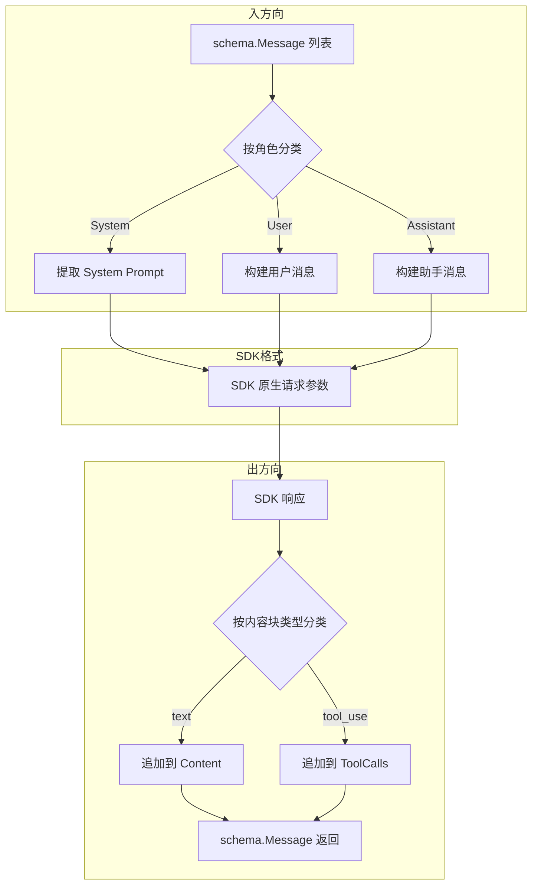

# LLM 提供者模块

> 包路径: `internal/provider`

## 模块简介

LLM 提供者模块是 go-my-harness 框架中负责对接大语言模型（LLM）推理服务的核心抽象层。它通过定义统一的 `LLMProvider` 接口，将不同 LLM 厂商的 API 差异封装在具体实现中，使上层 Agent 循环可以用一致的方式调用任何大模型。同时，本模块还提供了 JSON 驱动的配置加载机制，支持在运行时按名称选择模型与提供者。

### 核心功能

- **统一接口抽象**: 通过 `LLMProvider` 接口定义标准化的 `Generate` 方法签名，屏蔽不同 LLM 厂商 API 的差异。
- **OpenAI 兼容提供者**: `OpenAIProvider` 实现了对 OpenAI、DeepSeek 等兼容 OpenAI 协议的大模型调用。
- **Anthropic/Claude 兼容提供者**: `MiniMaxProvider` 实现了对 Anthropic Claude 系列及兼容 Anthropic 协议的大模型调用。
- **消息双向翻译**: 每个提供者负责将框架内部的 `schema.Message` 格式翻译为对应 SDK 格式，并将响应反向翻译回内部格式。
- **工具调用支持**: 完整支持 Tool Use / Function Calling，包括工具定义传递、工具调用请求解析和工具结果回传。
- **JSON 配置管理**: 通过 `AppConfig` 和 `LoadConfig` 从 JSON 文件加载模型配置，支持多模型定义与运行时切换。

---

## 架构总览



### 数据流



---

## 核心接口: LLMProvider

`LLMProvider` 是整个模块的核心抽象，定义了与大模型交互的唯一入口。

### 接口定义

```go
type LLMProvider interface {
    // Generate 接收当前的上下文历史、可用工具列表，并发起一次大模型推理
    Generate(ctx context.Context, messages []schema.Message, availableTools []schema.ToolDefinition) (*schema.Message, error)
}
```

### 职责说明

| 参数/返回值 | 类型 | 说明 |
|---|---|---|
| `ctx` | `context.Context` | 请求上下文，用于超时与取消控制 |
| `messages` | `[]schema.Message` | 对话历史，包含 system、user、assistant 及工具结果消息 |
| `availableTools` | `[]schema.ToolDefinition` | 当前可用的工具定义列表 |
| 返回值 | `*schema.Message` | 大模型返回的消息，可能包含文本内容和/或工具调用请求 |

所有 LLM 提供者实现都必须遵守此接口契约。上层 Agent 循环仅依赖此接口，不关心底层使用的是哪个 LLM 厂商。

### 交叉引用

Agent 循环如何调用此接口，请参考 [引擎核心](引擎核心.md) 模块文档。内部消息格式定义请参考 [Schema定义](引擎核心.md)。

---

## 组件详解

### 1. [OpenAIProvider](../internal/provider/openpi.go)（OpenAI 兼容提供者）

> 源文件: `internal/provider/openpi.go`

`OpenAIProvider` 实现了 `LLMProvider` 接口，用于调用兼容 OpenAI Chat Completions API 的大模型服务，包括 OpenAI 原生、DeepSeek 以及其他兼容端点。

#### 结构体

```go
type OpenAIProvider struct {
    client openai.Client
    model  string
}
```

| 字段 | 类型 | 说明 |
|---|---|---|
| `client` | `openai.Client` | OpenAI SDK 客户端实例 |
| `model` | `string` | 使用的模型名称，如 `gpt-4o`、`deepseek-chat` |

#### 构造函数

```go
func NewOpenAIProvider(apiKey, baseURL, model string) *OpenAIProvider
```

通过 API 密钥、基础 URL 和模型名称创建提供者实例。`baseURL` 参数使得此提供者可以灵活对接任何 OpenAI 兼容端点。

#### Generate 方法

```go
func (p *OpenAIProvider) Generate(
    ctx context.Context,
    msgs []schema.Message,
    availableTools []schema.ToolDefinition,
) (*schema.Message, error)
```

**执行流程:**

1. **消息翻译** — 遍历 `msgs`，将每种角色的 `schema.Message` 转换为 OpenAI SDK 对应的消息类型:
   - `RoleSystem` → `openai.SystemMessage`
   - `RoleUser` → `openai.UserMessage` 或 `openai.ToolMessage`（当 `ToolCallID` 非空时）
   - `RoleAssistant` → `ChatCompletionAssistantMessageParam`，包含文本内容和历史 ToolCalls

2. **工具定义翻译** — 将 `schema.ToolDefinition` 转换为 `shared.FunctionDefinitionParam`，支持直接断言和 JSON 往返序列化两种 fallback 策略。

3. **构建请求** — 创建 `ChatCompletionNewParams`，仅当存在可用工具时才挂载 Tools 参数（支撑"慢思考机制"）。

4. **发送请求** — 调用 `client.Chat.Completions.New` 发送请求。

5. **反向解析** — 将响应的第一个 Choice 翻译回 `schema.Message`，包括提取文本内容和工具调用信息。

#### 关键特性: 工具调用链维护

在处理 `RoleAssistant` 消息时，如果历史消息中包含 ToolCalls，必须原样放回请求中。这是维护大模型工具调用逻辑链的必要条件——大模型需要看到自己之前发起了哪些工具调用，才能正确理解后续的工具结果。

---

### 2. [MiniMaxProvider](../internal/provider/claude.go)（Anthropic/Claude 兼容提供者）

> 源文件: `internal/provider/claude.go`

`MiniMaxProvider` 实现了 `LLMProvider` 接口，用于调用 Anthropic Claude 系列及兼容 Anthropic Messages API 的大模型服务。尽管名称为 [MiniMaxProvider](../internal/provider/claude.go)，其底层使用的是 Anthropic SDK，因此适用于所有兼容 Anthropic 协议的端点。

#### 结构体

```go
type MiniMaxProvider struct {
    client anthropic.Client
    model  string
}
```

| 字段 | 类型 | 说明 |
|---|---|---|
| `client` | `anthropic.Client` | Anthropic SDK 客户端实例 |
| `model` | `string` | 使用的模型名称，如 `claude-3-5-sonnet-20241022` |

#### 构造函数

```go
func NewAnthropicProvider(apiKey, baseURL, model string) *MiniMaxProvider
```

通过 API 密钥、基础 URL 和模型名称创建提供者实例。

#### Generate 方法

```go
func (p *MiniMaxProvider) Generate(
    ctx context.Context,
    msgs []schema.Message,
    availableTools []schema.ToolDefinition,
) (*schema.Message, error)
```

**执行流程:**

1. **消息翻译** — 遍历 `msgs`，按角色将消息翻译为 Anthropic SDK 格式:
   - `RoleSystem` → 提取为 `systemPrompt` 字符串（Anthropic 的 System 是独立参数，不在 Messages 中）
   - `RoleUser` → `NewUserMessage`，区分普通文本和工具结果（`ToolResultBlock`）
   - `RoleAssistant` → `NewAssistantMessage`，包含 `TextBlock` 和 `ToolUseBlockParam`

2. **工具 Schema 翻译** — 将 `schema.ToolDefinition` 转换为 `anthropic.ToolParam`，提取 `properties` 和 `required` 字段构建 `ToolInputSchemaParam`。

3. **构建请求** — 创建 `MessageNewParams`，设置 `MaxTokens: 4096`，按需挂载 System 和 Tools。

4. **发送请求** — 调用 `client.Messages.New` 发送请求。

5. **反向解析** — 遍历响应的 `Content` 块:
   - `text` 类型 → 追加到 `resultMsg.Content`
   - `tool_use` 类型 → 转换为 `schema.ToolCall`，将 `Input` 序列化为 JSON 字节

#### Anthropic 与 OpenAI 的关键差异

| 差异点 | OpenAI | Anthropic |
|---|---|---|
| System Prompt | 作为 messages 数组的第一条 | 独立的 `System` 参数 |
| 工具调用表示 | `tool_calls` 数组 | `ToolUseBlockParam` 内嵌在消息中 |
| 工具结果回传 | `tool` 角色消息 | `ToolResultBlock` 内嵌在用户消息中 |
| MaxTokens | 可选 | 必填（硬编码 4096） |

---

### 3. 配置管理

> 源文件: `internal/provider/config.go`

配置管理组件负责从 JSON 文件加载和管理模型配置，支持多模型定义与运行时切换。

#### [AppConfig](../internal/provider/config.go)（应用配置）

```go
type AppConfig struct {
    DefaultModel string                 `json:"default_model"`
    Models       map[string]ModelConfig `json:"models"`
    Feishu       *FeishuConfig          `json:"feishu,omitempty"`
}
```

| 字段 | 类型 | 说明 |
|---|---|---|
| `DefaultModel` | `string` | 默认使用的模型名称，必须在 Models 中存在 |
| `Models` | `map[string]ModelConfig` | 模型名称到配置的映射 |
| `Feishu` | `*FeishuConfig` | 可选的飞书集成配置 |

#### [ModelConfig](../internal/provider/config.go)（模型配置）

```go
type ModelConfig struct {
    APIKey   string `json:"api_key"`
    BaseURL  string `json:"base_url"`
    Provider string `json:"provider"` // "openai" 或 "anthropic"
}
```

| 字段 | 类型 | 说明 |
|---|---|---|
| `APIKey` | `string` | API 密钥 |
| `BaseURL` | `string` | API 基础 URL，用于对接不同端点 |
| `Provider` | `string` | 提供者类型：`"openai"` 或 `"anthropic"` |

#### [FeishuConfig](../internal/provider/config.go)（飞书配置）

```go
type FeishuConfig struct {
    AppID       string `json:"app_id"`
    AppSecret   string `json:"app_secret"`
    EncryptKey  string `json:"encrypt_key"`
    VerifyToken string `json:"verify_token"`
}
```

飞书配置用于集成飞书机器人，包含应用凭证和事件验证密钥。详细用法请参考 [飞书集成](飞书集成.md)。

#### LoadConfig 函数

```go
func LoadConfig(configPath string) (*AppConfig, error)
```

**加载流程:**

1. **路径解析** — 如果传入相对路径，依次尝试:
   - 基于当前工作目录解析
   - 基于可执行文件所在目录解析

2. **文件读取与解析** — 读取 JSON 文件并反序列化为 `AppConfig`。

3. **校验** — 确保 `DefaultModel` 非空且 `Models` 映射不为空。

#### GetModelConfig 方法

```go
func (c *AppConfig) GetModelConfig(name string) (*ModelConfig, string, error)
```

根据模型名称获取对应配置。如果 `name` 为空字符串，自动使用 `DefaultModel`。返回模型配置指针、实际使用的模型名称和可能的错误。

#### 配置文件示例

```json
{
    "default_model": "deepseek",
    "models": {
        "deepseek": {
            "api_key": "sk-xxx",
            "base_url": "https://api.deepseek.com/v1",
            "provider": "openai"
        },
        "claude": {
            "api_key": "sk-ant-xxx",
            "base_url": "https://api.anthropic.com",
            "provider": "anthropic"
        }
    },
    "feishu": {
        "app_id": "cli_xxx",
        "app_secret": "xxx",
        "encrypt_key": "xxx",
        "verify_token": "xxx"
    }
}
```

---

## 提供者选择与初始化流程

以下展示了从配置加载到创建具体提供者实例的典型流程:



典型的初始化代码模式:

```go
// 1. 加载配置
cfg, err := provider.LoadConfig("config.json")

// 2. 获取模型配置
mc, modelName, err := cfg.GetModelConfig("") // 空字符串使用 default_model

// 3. 根据 provider 类型创建实例
var llm provider.LLMProvider
switch mc.Provider {
case "openai":
    llm = provider.NewOpenAIProvider(mc.APIKey, mc.BaseURL, modelName)
case "anthropic":
    llm = provider.NewAnthropicProvider(mc.APIKey, mc.BaseURL, modelName)
}

// 4. 在 Agent 循环中使用
resp, err := llm.Generate(ctx, messages, tools)
```

---

## Generate 方法的消息翻译机制

`Generate` 方法是两个提供者的核心，其最关键的设计是**消息双向翻译**机制。以下详细说明了翻译过程:



### 工具调用的完整生命周期

一次包含工具调用的对话往返中，消息在各层之间的流转:

1. **Agent 发起调用**: Agent 循环将对话历史和可用工具传递给 `Generate`
2. **翻译为 SDK 格式**: 提供者将 `schema.ToolDefinition` 翻译为 SDK 工具定义
3. **大模型返回工具调用**: 大模型响应中包含 `tool_use` / `function` 类型的工具调用请求
4. **反向翻译**: 提供者将工具调用翻译为 `schema.ToolCall` 返回给 Agent
5. **Agent 执行工具**: Agent 执行工具并将结果作为新的 user 消息追加到历史中
6. **再次调用 Generate**: 包含工具结果的历史再次传递给 `Generate`，大模型基于工具结果生成最终回答

详细的 Agent 循环流程请参考 [引擎核心](引擎核心.md)。

---

## 错误处理

两个提供者在错误处理上遵循相同模式:

- **API 请求失败**: 返回带上下文的 `fmt.Errorf`，包含底层错误信息
  - OpenAI: `"OpenAI/DeepSeek API 请求失败: %w"`
  - Anthropic: `"Claude/MiniMax API 请求失败: %w"`
- **空响应**: OpenAI 提供者额外检查 `resp.Choices` 是否为空
- **配置错误**: `LoadConfig` 对缺少 `default_model` 和空 `models` 映射进行显式校验

---

## 设计要点

### 接口隔离原则

`LLMProvider` 接口仅定义了一个 `Generate` 方法，遵循 Go 小接口设计哲学。这使得:
- 新增提供者只需实现一个方法
- 上层代码仅依赖接口，方便 mock 测试
- 未来可以轻松添加流式输出等新方法而不影响现有实现

### 消息翻译的双向性

每个提供者都承担了**入方向翻译**（schema → SDK）和**出方向翻译**（SDK → schema）的双重职责。这种设计将翻译逻辑与业务逻辑完全分离，上层 Agent 不需要了解任何 SDK 细节。

### 工具调用的上下文维护

两个提供者都特别注意在翻译 assistant 消息时保留历史 ToolCalls。这是大模型工具调用的关键约束——大模型需要看到完整的调用链才能正确推理。遗漏历史 ToolCalls 会导致大模型产生不一致或错误的响应。

### 配置驱动的灵活性

通过 JSON 配置文件和 `Provider` 字段，可以在不修改代码的情况下切换不同的 LLM 提供者。`BaseURL` 字段使得同一提供者类型可以对接不同的服务端点（如自托管模型、代理服务等）。

---

## 与其他模块的关系

| 依赖模块 | 关系 | 说明 |
|---|---|---|
| [引擎核心](引擎核心.md) | 被调用 | Agent 循环通过 LLMProvider 接口调用 Generate 方法 |
| [引擎核心](引擎核心.md) | 数据依赖 | 使用 schema.[Message](../internal/schema/message.go) 和 schema.[ToolDefinition](../internal/schema/message.go) 作为数据格式 |
| [飞书集成](飞书集成.md) | 配置依赖 | [AppConfig](../internal/provider/config.go) 中可选包含 [FeishuConfig](../internal/provider/config.go) |
| [工具系统](工具系统.md) | 数据依赖 | Generate 接收 [ToolDefinition](../internal/schema/message.go)，返回包含 [ToolCall](../internal/schema/message.go) 的消息 |


<!-- crosslinks (auto-generated) -->
## Related Modules
- Used by: [应用入口](应用入口.md), [引擎核心](引擎核心.md)
