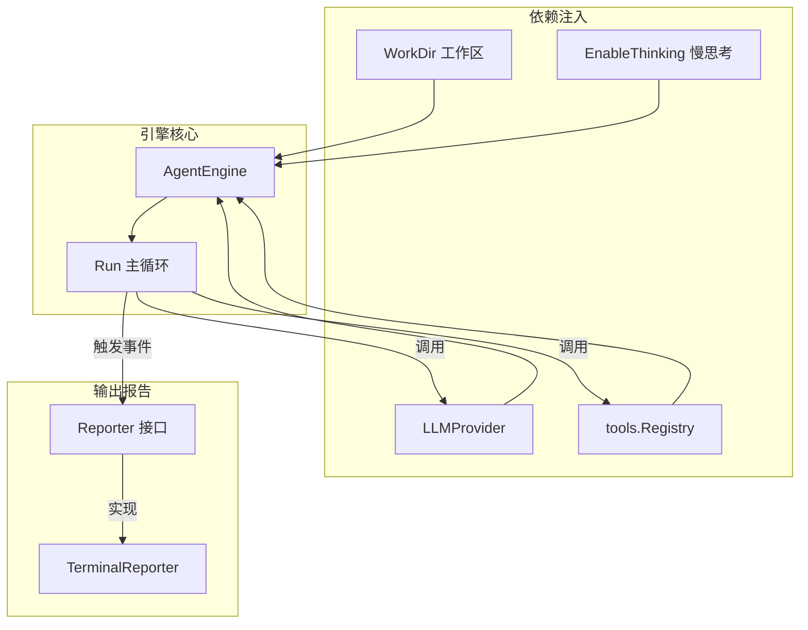
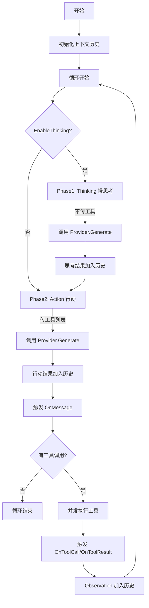

# 引擎层 — Agent 主循环模块

> 源码路径：`internal/engine/`

## 模块简介

引擎层是 `go-my-harness` 框架的**核心大脑**。`AgentEngine` 实现了经典的 ReAct（Reasoning + Acting）循环，驱动大模型在「思考」与「行动」之间交替推进，直到任务完成。同时，`Reporter` 接口将引擎内部状态向外界输出，实现引擎与展现层（终端、飞书等）的解耦。

## 架构概览



## 核心组件

### AgentEngine — `loop.go`

引擎的核心结构体，持有运行所需的全部依赖：

```go
type AgentEngine struct {
    provider       provider.LLMProvider // LLM 提供者
    registry       tools.Registry      // 工具注册表
    WorkDir        string              // 工作目录
    EnableThinking bool                // 慢思考模式开关
}
```

### Run 主循环 — ReAct 循环实现

`Run` 方法是整个框架的心脏，实现了 Thinking-Action-Observation 三阶段循环：



**循环详解**：

#### Phase 1: Thinking（慢思考）

当 `EnableThinking` 为 true 时，引擎先发起一次**不带工具**的推理请求：

```go
thinkResp, err := e.provider.Generate(ctx, contextHistory, nil)
```

传入 `nil` 作为工具列表，模型不会调用工具，而是纯粹进行推理。这一步的目的是让模型在行动前充分思考策略。思考结果通过 `OnThinking` 事件通知 Reporter。

#### Phase 2: Action（行动）

引擎带上完整工具列表发起推理请求：

```go
actionResp, err := e.provider.Generate(ctx, contextHistory, availableTools)
```

模型此时可以选择调用工具或直接给出最终回答。若 `actionResp.Content` 非空，触发 `OnMessage` 事件。

#### 退出判断与并发执行

- 若 `actionResp.ToolCalls` 为空，说明模型认为任务已完成，退出循环。
- 若有工具调用，使用 `sync.WaitGroup` **并发执行**所有工具调用，每个工具调用在独立 Goroutine 中运行。

#### Observation 收集

工具执行结果按原始顺序写入 `observationMsgs` 数组（通过索引 `idx` 保证顺序），然后追加到 `contextHistory`，进入下一轮循环。

**Reporter 输出截断**：为防止大文件读取导致飞书消息过长被截断，Reporter 收到的输出被截断至 200 字符。但传给大模型的 `observationMsgs` 依然是完整数据。

### Reporter 接口 — `reporter.go`

定义了 Agent 引擎向外界输出信息的规范，使引擎可无缝切换终端、飞书、钉钉甚至 WebUI 等展现层：

```go
type Reporter interface {
    OnThinking(ctx context.Context)
    OnToolCall(ctx context.Context, toolName string, args string)
    OnToolResult(ctx context.Context, toolName string, result string, isError bool)
    OnMessage(ctx context.Context, content string)
}
```

| 事件 | 触发时机 | 用途 |
|------|----------|------|
| `OnThinking` | 模型开始慢思考 | 提示用户模型正在推理 |
| `OnToolCall` | 模型决定调用工具 | 报告即将执行的工具及参数 |
| `OnToolResult` | 工具执行完毕 | 汇报工具执行结果（截断版）|
| `OnMessage` | 模型输出最终文本 | 展示模型的阶段性总结或最终回复 |

### TerminalReporter — `reporter.go`

终端模式下的输出报告器，直接打印到控制台：

- `OnThinking`：打印 `🤔 (模型正在思考...)`
- `OnToolCall`：打印 `🛠️ [工具调用] 工具名(参数)`
- `OnToolResult`：成功打印 `✅`，失败打印 `❌`，结果截断至 500 字符
- `OnMessage`：打印 `📝 内容`

## 与其他模块的关联

- **依赖 [Provider 层](provider.md)**：调用 `LLMProvider.Generate()` 进行推理。
- **依赖 [工具层](tools.md)**：调用 `Registry.GetAvailableTools()` 和 `Registry.Execute()`。
- **依赖 [Schema 层](schema.md)**：使用 `Message` 维护上下文历史。
- **被 [入口层](entry.md) 依赖**：`main()` 创建 `AgentEngine` 并调用 `Run()`。
- **被 [飞书集成](feishu.md) 依赖**：`FeishuBot` 持有 `AgentEngine` 引用，`FeishuReporter` 实现 `Reporter` 接口。

## 设计哲学

引擎层体现了框架的**关注点分离**与**并发安全**原则：

1. **ReAct 范式**：将推理与行动分离，Thinking 阶段让模型充分思考策略，Action 阶段才允许调用工具，提升决策质量。
2. **Reporter 解耦**：引擎不关心输出到哪里，通过 Reporter 接口实现展现层的可插拔。
3. **并发执行**：多个工具调用并发执行，通过 `WaitGroup` + 索引数组保证结果顺序，兼顾效率与正确性。