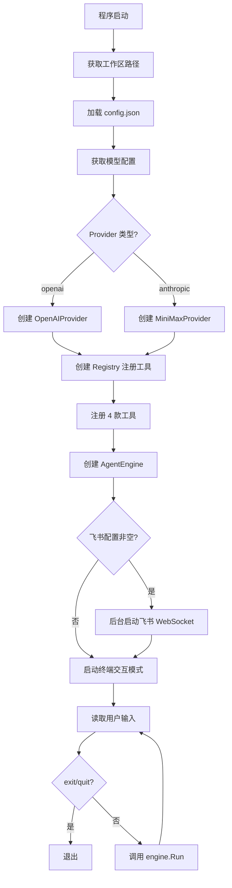

# 入口层 — 程序启动模块

> 源码路径：`cmd/claw/main.go`

## 模块简介

入口层是 `go-my-harness` 框架的**启动与编排中心**。`main()` 函数完成了从配置加载、Provider 创建、工具注册、引擎实例化到双模式启动的全部装配工作。它同时支持**终端交互模式**（始终启动）和**飞书 WebSocket 模式**（配置非空时后台启动），让用户可以在命令行和 IM 两种场景下使用 Agent。

## 架构概览



## 核心流程

### 1. 配置加载

```go
workDir, _ := os.Getwd()
configPath := filepath.Join(workDir, "config.json")
cfg, err := provider.LoadConfig(configPath)
```

以当前工作目录作为 WorkDir，加载同目录下的 `config.json`。获取默认模型配置后打印使用的模型名称和 Provider 类型。

### 2. Provider 创建

根据 `ModelConfig.Provider` 字段选择创建对应的 LLM Provider：

```go
switch mc.Provider {
case "openai":
    llmProvider = provider.NewOpenAIProvider(mc.APIKey, mc.BaseURL, modelName)
case "anthropic":
    llmProvider = provider.NewAnthropicProvider(mc.APIKey, mc.BaseURL, modelName)
default:
    log.Fatalf("不支持的 provider 类型: %s", mc.Provider)
}
```

### 3. 工具注册

创建 `Registry` 并注册四款内置工具，全部绑定到 WorkDir：

```go
registry := tools.NewRegistry()
registry.Register(tools.NewReadFileTool(workDir))
registry.Register(tools.NewWriteFileTool(workDir))
registry.Register(tools.NewBashTool(workDir))
registry.Register(tools.NewEditFileTool(workDir))
```

### 4. 引擎实例化

```go
eng := engine.NewAgentEngine(llmProvider, registry, workDir, true)
```

`EnableThinking` 设为 `true`，开启慢思考模式。

### 5. 双模式启动

#### 飞书 WebSocket 模式（可选）

当 `config.json` 中飞书字段非空时，后台启动飞书机器人：

```go
if cfg.Feishu != nil && cfg.Feishu.AppID != "" && cfg.Feishu.AppSecret != "" {
    bot := feishu.NewFeishuBot(eng, cfg.Feishu)
    go func() {
        bot.StartWebSocket(ctx)
    }()
}
```

飞书模式在独立 Goroutine 中运行，不阻塞主流程。

#### 终端交互模式（始终启动）

主线程进入终端交互循环，使用 `TerminalReporter` 输出：

```go
reporter := engine.NewTerminalReporter()
scanner := bufio.NewScanner(os.Stdin)
```

**信号处理**：监听 `SIGINT` 和 `SIGTERM`，支持优雅退出。

**输入读取**：使用独立 Goroutine + Channel 读取 stdin，配合 `select` 实现非阻塞等待，使信号能中断正在运行的 Agent 任务。

**任务执行**：每条用户输入在独立 Goroutine 中调用 `eng.Run()`，通过 `done` channel 和 `sigChan` 的 `select` 实现任务可被信号中断：

```go
select {
case <-done:
    runCancel()
case <-sigChan:
    runCancel()
    <-done
    cancel()
    return
}
```

## 与其他模块的关联

入口层是**依赖注入的装配点**，连接了所有内部模块：

- **依赖 [Provider 层](provider.md)**：加载配置、创建 LLM Provider。
- **依赖 [工具层](tools.md)**：创建 Registry 并注册工具。
- **依赖 [引擎层](engine.md)**：创建 AgentEngine 并调用 Run()，使用 TerminalReporter。
- **依赖 [飞书集成](feishu.md)**：条件性启动 FeishuBot。

## 设计哲学

入口层体现了框架的**组合优于继承**与**优雅退出**原则：

1. **依赖注入**：所有组件在 `main()` 中装配，通过构造函数注入依赖，组件之间无硬编码耦合。
2. **双模式并存**：终端模式始终可用，飞书模式按需启用，两者共享同一个 `AgentEngine` 实例。
3. **信号安全**：通过 Goroutine + Channel + Context 的组合，实现任务级和进程级的优雅中断。