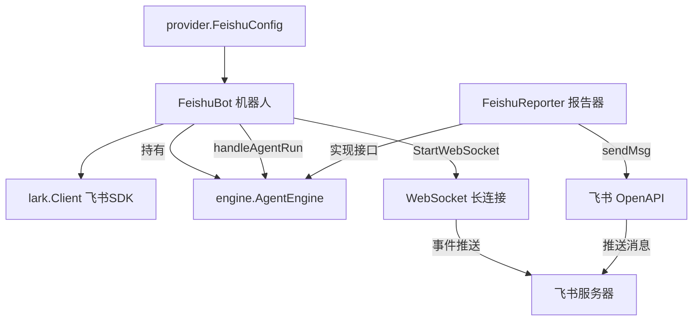

# 飞书集成 — IM 接入模块

> 源码路径：`internal/feishu/bot.go`

## 模块简介

飞书集成模块是 `go-my-harness` 框架的**即时通讯展现层**。它通过飞书官方 SDK（`larksuite/oapi-sdk-go`）实现 WebSocket 长连接模式接收消息事件，将飞书会话作为 Agent 的交互入口。模块内含 `FeishuBot`（机器人主体）和 `FeishuReporter`（飞书报告器），后者实现了引擎层的 `Reporter` 接口，将 Agent 的思考、工具调用、最终回复实时推送到飞书会话。

## 架构概览



## 核心组件

### FeishuBot — 机器人主体

封装了飞书机器人的配置与核心业务流：

```go
type FeishuBot struct {
    client      *lark.Client
    appID       string
    appSecret   string
    encryptKey  string
    verifyToken string
    engine      *engine.AgentEngine
}
```

#### NewFeishuBot 构造函数

接收 `AgentEngine` 引擎实例和 `FeishuConfig` 配置，实例化飞书官方客户端。若 `AppID` 或 `AppSecret` 为空则直接 `log.Fatal`。

#### StartWebSocket — WebSocket 长连接模式

推荐的部署方式，优势显著：

- 无需公网 IP
- 无需配置回调 URL
- 自动重连（`WithAutoReconnect(true)`）
- 部署简单

流程：创建事件处理器 → 创建 WebSocket 客户端 → 阻塞式启动长连接。

#### GetEventDispatcher — HTTP 回调模式

传统方式，需要公网 IP 和配置回调 URL。通过 `createEventDispatcher(verifyToken, encryptKey)` 创建带验证的调度器。

#### createEventDispatcher — 事件调度器

HTTP 和 WebSocket 共用的事件处理逻辑，监听两类事件：

1. **`OnP2MessageReceiveV1`（接收消息）**：
   - 从消息体 JSON 中提取文本内容（去除 `{"text":"` 前缀和 `"}` 后缀）。
   - 提取 `chatId`（会话 ID）。
   - **并发处理**：为每个请求开启独立 Goroutine 调用 `handleAgentRun`，绝不阻塞回调。

2. **`OnP2MessageReadV1`（消息已读）**：静默忽略，避免日志干扰。

#### handleAgentRun — 引擎调用桥梁

连接飞书与底层引擎的桥梁：

```go
func (b *FeishuBot) handleAgentRun(chatId string, prompt string) {
    reporter := &FeishuReporter{client: b.client, chatId: chatId}
    err := b.engine.Run(context.Background(), prompt, reporter)
    if err != nil {
        reporter.sendMsg(fmt.Sprintf("Agent 运行崩溃: %v", err))
    }
}
```

为当前聊天窗口实例化专属的 `FeishuReporter`，然后启动引擎。

### FeishuReporter — 飞书报告器

实现了 `engine.Reporter` 接口，将引擎输出格式化后发送到飞书会话：

```go
type FeishuReporter struct {
    client *lark.Client
    chatId string
}
```

#### sendMsg — 消息发送

封装飞书 OpenAPI 的消息创建操作，构建文本类型消息（`MsgTypeText`），通过 `Im.Message.Create` 发送到指定 `chatId`。

#### 接口实现

| 方法 | 行为 |
|------|------|
| `OnThinking` | 发送模型正在慢思考提示，轻量级避免刷屏 |
| `OnToolCall` | 发送正在执行工具名称及参数 |
| `OnToolResult` | 成功发送执行成功，失败发送执行报错及详情 |
| `OnMessage` | 将模型最终纯文本回答发给用户 |

**编译时类型检查**：
```go
var _ engine.Reporter = (*FeishuReporter)(nil)
```
确保 `FeishuReporter` 正确实现了 `Reporter` 接口。

## 与其他模块的关联

- **依赖 [引擎层](engine.md)**：持有 `AgentEngine` 引用，`FeishuReporter` 实现 `Reporter` 接口。
- **依赖 [Provider 层](provider.md)**：使用 `provider.FeishuConfig` 获取飞书配置。
- **被 [入口层](entry.md) 依赖**：`main()` 根据 `config.json` 中飞书字段是否非空，决定是否后台启动飞书机器人。

## 设计哲学

飞书集成模块体现了框架的**多端适配**与**非阻塞并发**原则：

1. **Reporter 适配**：通过实现 `Reporter` 接口，飞书模块无需修改引擎任何代码即可接入，展现了接口解耦的威力。
2. **Goroutine 隔离**：每条飞书消息在独立 Goroutine 中处理，避免回调阻塞导致飞书 SDK 超时重试。
3. **双模式支持**：同时支持 WebSocket（推荐）和 HTTP 回调两种接入方式，适应不同部署环境。