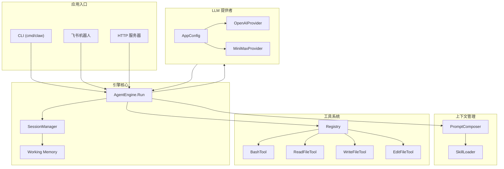
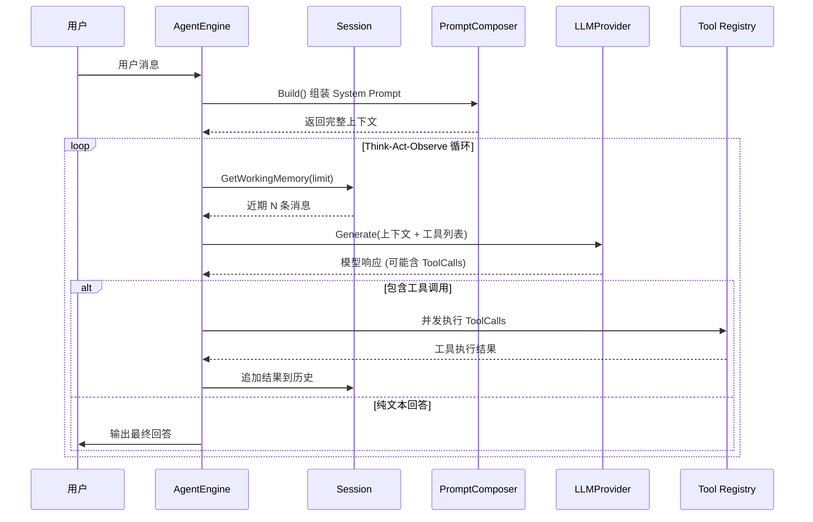

# go-my-harness 仓库总览

## 项目简介

go-my-harness 是一个基于 Go 语言开发的 AI Agent 框架，采用“驾驭工程”（Harness Engineering）理念构建。项目实现了完整的 Agent 运行循环——思考(Think) → 行动(Act) → 观察(Observe)，支持 OpenAI 和 Anthropic 双模型后端，提供 CLI、飞书机器人、HTTP 服务三种交互入口。

项目核心特性：

- **无状态引擎**：[AgentEngine](../internal/engine/loop.go) 本身不维护状态，通过 [Session](../internal/engine/session.go) 实现多端并发隔离
- **工作记忆管理**：滑动窗口截取近期对话，控制上下文长度，自动处理 API 兼容性问题
- **插件化工具系统**：基于 [BaseTool](../internal/tools/registry.go) 接口 + [Registry](../internal/tools/registry.go) 注册表模式，内置 Bash/Read/Write/Edit 四种工具
- **外部化上下文**：[PromptComposer](../internal/context/composer.go) 从工作区动态加载 AGENTS.md 和 Skills，实现“内核稳定、外围可扩展”
- **多模型支持**：通过 LLMProvider 接口统一 OpenAI 和 Anthropic API，配置驱动、运行时切换

## 端到端架构



## Agent 运行循环



## 模块文档索引

| 模块 | 组件数 | 说明 |
|------|--------|------|
| [应用入口](应用入口.md) | 3 + 子模块 | CLI、HTTP 服务器、飞书集成等启动入口 |
| &nbsp;&nbsp;└─ [飞书集成](飞书集成.md) | 12 | 飞书机器人对接，WebSocket/HTTP 双模式 |
| [引擎核心](引擎核心.md) | 28 | Agent 主循环、会话管理、工作记忆、事件报告 |
| [上下文管理](上下文管理.md) | 8 | 提示词组装、AGENTS.md 加载、技能外挂 |
| [LLM提供者](LLM提供者.md) | 12 | OpenAI/Anthropic 双模型抽象、配置管理 |
| [工具系统](工具系统.md) | 33 | Bash/Read/Write/Edit 工具、注册表路由 |

## 项目结构

```
go-my-harness/
├── cmd/claw/main.go          # CLI 入口（主力运行模式）
├── server.go                  # HTTP 服务器入口（预留）
├── helloworld.go              # 最小示例
├── config.json                # 应用配置（模型 + 飞书）
├── internal/
│   ├── engine/                # 引擎核心
│   │   ├── loop.go            #   AgentEngine 主循环
│   │   ├── session.go         #   Session 会话管理
│   │   ├── reporter.go        #   Reporter 事件接口
│   │   └── terminal_repoter.go#   终端输出实现
│   ├── context/               # 上下文管理
│   │   ├── composer.go        #   PromptComposer 提示词组装
│   │   └── skill.go           #   SkillLoader 技能加载
│   ├── provider/              # LLM 提供者
│   │   ├── interface.go       #   LLMProvider 接口
│   │   ├── openpi.go          #   OpenAI 实现
│   │   ├── claude.go          #   Anthropic 实现
│   │   └── config.go          #   配置管理
│   ├── tools/                 # 工具系统
│   │   ├── registry.go        #   BaseTool + Registry
│   │   ├── bash.go            #   Bash 执行
│   │   ├── read_file.go       #   文件读取
│   │   ├── write_file.go      #   文件写入
│   │   └── edit_file.go       #   文件编辑
│   ├── schema/                # 共享数据模型
│   │   └── message.go         #   Message, ToolCall, ToolResult
│   └── feishu/                # 飞书集成
│       └── bot.go             #   FeishuBot + FeishuReporter
└── go.mod                     # Go 1.26+, anthropic-sdk-go, openai-go, oapi-sdk-go
```

## 技术栈

| 类别 | 技术 | 版本/说明 |
|------|------|----------|
| 语言 | Go | 1.26+ |
| LLM SDK | openai-go | v3.37.0，OpenAI 兼容协议 |
| LLM SDK | anthropic-sdk-go | v1.45.0，Anthropic 协议 |
| IM 平台 | oapi-sdk-go | v3.9.5，飞书官方 SDK |
| 通信 | WebSocket | 飞书长连接模式，自动重连 |
| 并发 | goroutine + sync.RWMutex | [Session](../internal/engine/session.go) 并发安全、工具并发执行 |

## 设计原则

1. **无状态引擎**：[AgentEngine](../internal/engine/loop.go) 不维护任何状态，所有上下文通过 [Session](../internal/engine/session.go) 传入，实现“用完即走”
2. **外部化状态**：System Prompt 从文件系统动态加载（AGENTS.md + Skills），而非硬编码
3. **接口驱动**：LLMProvider、[BaseTool](../internal/tools/registry.go)、[Reporter](../internal/engine/reporter.go) 均通过接口抽象，支持多实现切换
4. **物理隔离**：每个 [Session](../internal/engine/session.go) 绑定独立工作区，不同用户/群聊的数据完全隔离
5. **驾驭记忆**：Working Memory 截取而非全量返回，控制 API 成本同时保持对话连贯性

## Related Modules
- [应用入口](应用入口.md)
- [引擎核心](引擎核心.md)
- [上下文管理](上下文管理.md)
- [LLM提供者](LLM提供者.md)
- [工具系统](工具系统.md)
- [飞书集成](飞书集成.md)