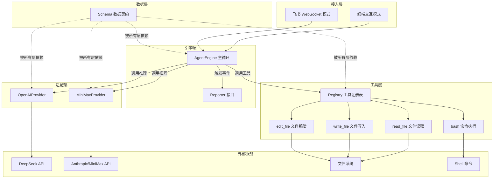

# go-my-harness 仓库总览

## 项目简介

`go-my-harness` 是一个基于 Go 语言开发的 **AI Agent Harness 框架**。它实现了经典的 ReAct（Reasoning + Acting）循环，让大语言模型能够通过工具调用与物理世界交互——执行命令、读写文件、编辑代码。框架支持多 LLM 厂商（OpenAI/DeepSeek、Anthropic/MiniMax），并提供终端交互和飞书 IM 两种接入方式。

**技术栈**：Go 1.26 + OpenAI SDK v3 + Anthropic SDK + Lark SDK

## 端到端架构



## 模块文档导航

| 模块 | 文档 | 职责 |
|------|------|------|
| Schema 层 | [schema.md](schema.md) | 定义 Message/ToolCall/ToolResult/ToolDefinition 数据契约 |
| Provider 层 | [provider.md](provider.md) | 适配 OpenAI/Anthropic API，加载应用配置 |
| 工具层 | [tools.md](tools.md) | 工具注册表与四款内置工具（bash/read/write/edit）|
| 引擎层 | [engine.md](engine.md) | ReAct 主循环（Thinking-Action-Observation）+ Reporter 接口 |
| 飞书集成 | [feishu.md](feishu.md) | 飞书 WebSocket 接入 + FeishuReporter |
| 入口层 | [entry.md](entry.md) | 程序装配与双模式启动 |

## 核心工作流

框架的核心是 `AgentEngine.Run()` 方法实现的 ReAct 循环：

1. **Thinking 阶段**：不带工具调用 LLM，让模型纯粹推理策略（可选，由 `EnableThinking` 控制）
2. **Action 阶段**：带上工具列表调用 LLM，模型决定调用工具或给出最终回答
3. **Observation 阶段**：并发执行模型请求的工具调用，将结果追加到上下文历史
4. **循环**：重复 1-3，直到模型不再请求工具调用（任务完成）

## 项目结构

```
go-my-harness/
├── cmd/claw/main.go          # 程序入口
├── internal/
│   ├── engine/                # 引擎层（主循环 + Reporter）
│   │   ├── loop.go
│   │   └── reporter.go
│   ├── tools/                 # 工具层（注册表 + 4款工具）
│   │   ├── registry.go
│   │   ├── bash.go
│   │   ├── read_file.go
│   │   ├── write_file.go
│   │   └── edit_file.go
│   ├── provider/              # Provider层（LLM适配 + 配置）
│   │   ├── interface.go
│   │   ├── config.go
│   │   ├── claude.go
│   │   └── openpi.go
│   ├── schema/                # 数据契约层
│   │   └── message.go
│   └── feishu/                # 飞书集成
│       └── bot.go
├── config.json                # 应用配置（模型 + 飞书）
├── models.json                # 模型配置
├── go.mod
└── repowiki/                  # 生成的 Wiki 文档
```

## 关键设计决策

### 1. 通用 Schema 解耦 LLM 厂商

框架定义了与厂商无关的 `schema.Message` 数据结构，所有 LLM 差异封装在 Provider 层的翻译逻辑中。新增厂商只需实现 `LLMProvider.Generate()` 方法。

### 2. 工具错误自愈机制

工具执行错误不中断流程，而是以 `ToolResult(IsError=true)` 形式回传给大模型。模型基于错误信息自主分析并调整策略，实现 Self-Correction。

### 3. Reporter 接口实现多端适配

引擎通过 `Reporter` 接口输出内部状态，终端和飞书各自实现该接口。引擎不关心输出到哪里，展现层可自由扩展（如 WebUI、钉钉）。

### 4. 并发工具执行

多个工具调用通过 `sync.WaitGroup` 并发执行，通过索引数组保证结果顺序，兼顾效率与正确性。

### 5. 多重安全防线

所有工具受 WorkDir 约束，内置超时控制（bash 30s）、长度截断（8000 字节）、模糊匹配（edit_file 四级策略）等防御性编程机制。

## 快速开始

```bash
# 1. 配置 config.json（填入 API Key 和飞书凭据）
# 2. 安装依赖
go mod tidy
# 3. 运行
 go run ./cmd/claw
```

终端模式始终启动，飞书模式在配置非空时后台自动启动。