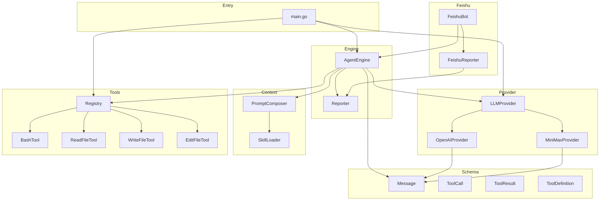
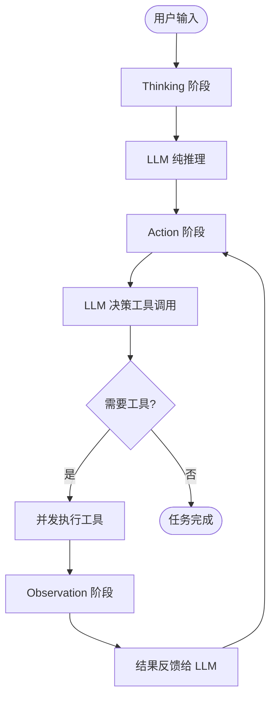
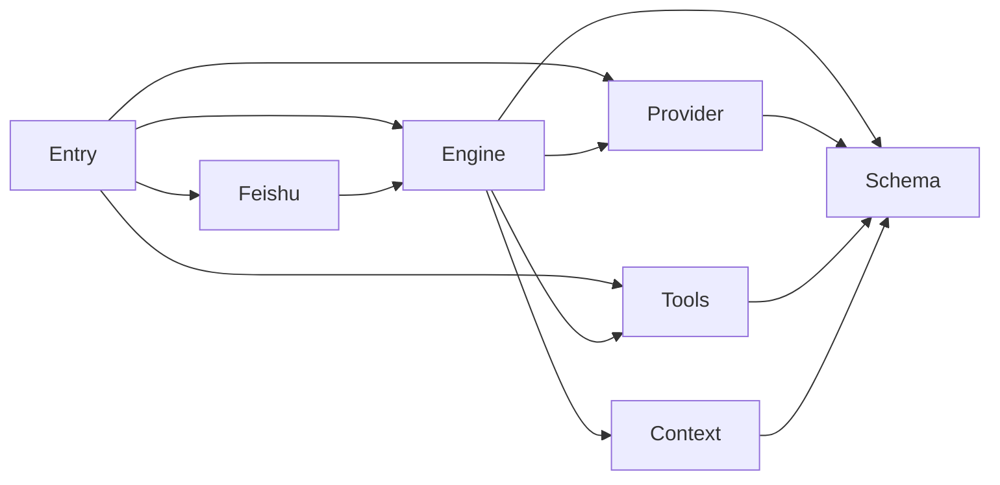

# go-my-harness 项目总览

## 项目简介

**go-my-harness** 是一个基于 Go 语言构建的 AI Agent 框架，实现了经典的 **ReAct（Reasoning + Acting）** 循环模式。项目的核心理念是"驾驭工程"（Harness Engineering）——安全地控制和引导大语言模型（LLM）与真实世界交互，通过工具调用执行 Shell 命令、读写文件、编辑代码等操作。

项目采用 Go 编写，追求极致性能与最小依赖。整个框架仅 20 个 Go 源文件，却实现了完整的 Agent 运行时，包括多模型支持、可插拔工具系统、双输出通道（终端 + 飞书 IM）和动态提示词组装。

## 端到端架构



## ReAct 循环流程



## 核心模块

| 模块 | 路径 | 职责 | 文档 |
|------|------|------|------|
| **Entry** | `cmd/claw/` | 应用入口，组装所有模块并启动 Agent | [Entry.md](Entry.md) |
| **Engine** | `internal/engine/` | ReAct 循环引擎，驱动 Thinking → Action → Observation | [Engine.md](Engine.md) |
| **Provider** | `internal/provider/` | LLM 提供者抽象层，支持 OpenAI/Anthropic 协议 | [Provider.md](Provider.md) |
| **Tools** | `internal/tools/` | 可插拔工具注册表 + 4 个内置工具 | [Tools.md](Tools.md) |
| **Context** | `internal/context/` | 动态系统提示词组装 + 技能加载器 | [Context.md](Context.md) |
| **Schema** | `internal/schema/` | 核心数据契约：Message、ToolCall、ToolResult、ToolDefinition | [Schema.md](Schema.md) |
| **Feishu** | `internal/feishu/` | 飞书 WebSocket 机器人 + 飞书 Reporter | [Feishu.md](Feishu.md) |

## 模块依赖关系



## 技术栈

- **语言**: Go 1.26+
- **LLM SDK**: `openai-go/v3`（OpenAI 兼容协议）、`anthropic-sdk-go`（Anthropic 协议）
- **IM 集成**: `oapi-sdk-go/v3`（飞书开放平台 SDK）
- **架构模式**: ReAct Agent Loop、接口驱动（Interface-driven）、观察者模式（Reporter）

## 安全机制

项目内置了多层安全防护：

- **工作目录隔离**: 所有工具操作限制在 `workspace/` 目录内
- **超时控制**: Bash 命令 30 秒超时，防止无限执行
- **输出截断**: 工具输出超过 8000 字节自动截断
- **错误自修正**: 工具执行错误不崩溃，反馈给 LLM 让其自行修正
- **模糊匹配**: EditFileTool 采用 4 级匹配策略，容忍格式差异

## 快速开始

```bash
# 安装依赖
go mod tidy

# 配置模型（编辑 config.json）
# 支持 OpenAI 兼容和 Anthropic 兼容两种协议

# 运行
go run ./cmd/claw/
```

## 项目结构

```
go-my-harness/
├── cmd/claw/main.go          # 应用入口
├── internal/
│   ├── context/               # 提示词系统
│   │   ├── composer.go        # 动态 Prompt 组装
│   │   └── skill.go           # 技能加载器
│   ├── engine/                # Agent 引擎
│   │   ├── loop.go            # ReAct 循环核心
│   │   ├── reporter.go        # 输出抽象接口
│   │   └── terminal_repoter.go # 终端输出实现
│   ├── feishu/                # 飞书集成
│   │   └── bot.go             # WebSocket 机器人 + Reporter
│   ├── provider/              # LLM 提供者
│   │   ├── interface.go       # 接口定义
│   │   ├── config.go          # 配置解析
│   │   ├── openpi.go          # OpenAI 兼容实现
│   │   └── claude.go          # Anthropic 兼容实现
│   ├── schema/                # 数据模型
│   │   └── message.go         # 核心数据结构
│   └── tools/                 # 工具系统
│       ├── registry.go        # 注册表接口
│       ├── bash.go            # Shell 命令执行
│       ├── read_file.go       # 文件读取
│       ├── write_file.go      # 文件写入
│       └── edit_file.go       # 模糊编辑
├── workspace/                 # Agent 沙箱目录
├── config.json                # 运行时配置
└── go.mod                     # 模块定义
```
