# Provider 层 — LLM 适配模块

> 源码路径：`internal/provider/`

## 模块简介

Provider 层是 `go-my-harness` 框架与外部大语言模型（LLM）通信的**统一适配层**。它通过 `LLMProvider` 接口抽象了不同厂商的 API 差异，当前支持两种 Provider 实现：基于 OpenAI SDK 的 `OpenAIProvider`（兼容 DeepSeek）和基于 Anthropic SDK 的 `MiniMaxProvider`（兼容 Claude 格式）。同时，本模块还负责从 `config.json` 加载应用配置。

## 架构概览

```mermaid
graph TD
    subgraph 配置层
        AppConfig[AppConfig 应用配置]
        ModelConfig[ModelConfig 模型配置]
        FeishuConfig[FeishuConfig 飞书配置]
        AppConfig --> ModelConfig
        AppConfig --> FeishuConfig
    end

    subgraph 接口层
        LLMProvider[LLMProvider 接口]
    end

    subgraph 实现层
        OpenAIProvider[OpenAIProvider]
        MiniMaxProvider[MiniMaxProvider]
    end

    LLMProvider -->|实现| OpenAIProvider
    LLMProvider -->|实现| MiniMaxProvider
    ModelConfig -->|provider=openai| OpenAIProvider
    ModelConfig -->|provider=anthropic| MiniMaxProvider

    OpenAIProvider -->|调用| OpenAIAPI[OpenAI/DeepSeek API]
    MiniMaxProvider -->|调用| AnthropicAPI[Anthropic/MiniMax API]
```



## 核心组件

### LLMProvider 接口 — `interface.go`

这是整个 Provider 层的核心契约，定义了与大模型通信的统一接口：

```go
type LLMProvider interface {
    Generate(ctx context.Context, messages []schema.Message,
        availableTools []schema.ToolDefinition) (*schema.Message, error)
}
```

`Generate` 方法接收当前的上下文历史和可用工具列表，发起一次大模型推理，返回模型的响应消息。引擎层在主循环中反复调用此方法，驱动 Thinking 和 Action 两个阶段。

### 配置体系 — `config.go`

#### AppConfig

`config.json` 的顶层结构，包含模型配置和飞书配置：

```go
type AppConfig struct {
    DefaultModel string                 `json:"default_model"`
    Models       map[string]ModelConfig `json:"models"`
    Feishu       *FeishuConfig          `json:"feishu,omitempty"`
}
```

#### ModelConfig

单个模型的连接配置：

```go
type ModelConfig struct {
    APIKey   string `json:"api_key"`
    BaseURL  string `json:"base_url"`
    Provider string `json:"provider"` // "openai" 或 "anthropic"
}
```

#### LoadConfig 与 GetModelConfig

- `LoadConfig(configPath)`：从指定路径加载配置文件，支持相对路径自动解析（先查当前工作目录，再查可执行文件目录）。
- `GetModelConfig(name)`：获取指定模型配置，`name` 为空时返回 `DefaultModel`。

### OpenAIProvider — `openpi.go`

基于 OpenAI Go SDK v3 实现，兼容所有 OpenAI 格式的 API 端点（如 DeepSeek）。

**构造函数**：
```go
func NewOpenAIProvider(apiKey, baseURL, model string) *OpenAIProvider
```

**Generate 方法的翻译流程**：

1. **消息翻译**：将内部 `schema.Message` 翻译为 OpenAI SDK 的 `ChatCompletionMessageParamUnion`：
   - `RoleSystem` → `openai.SystemMessage()`
   - `RoleUser`（含 ToolCallID）→ `openai.ToolMessage()`
   - `RoleUser`（普通）→ `openai.UserMessage()`
   - `RoleAssistant` → 构建带 `ToolCalls` 的 assistant 消息

2. **工具翻译**：将 `ToolDefinition` 翻译为 `ChatCompletionFunctionTool`，参数 schema 通过 `shared.FunctionParameters` 传递。

3. **慢思考机制**：仅当 `availableTools` 非空时才挂载 `Tools` 参数。引擎层利用此特性实现 Thinking 阶段（不传工具）与 Action 阶段（传工具）的分离。

4. **响应反向解析**：将 API 返回的 `choice.Message` 转回内部 `schema.Message`，提取 `ToolCalls` 中的 function 类型调用。

### MiniMaxProvider — `claude.go`

基于 Anthropic Go SDK 实现，兼容 Claude 格式的 API 端点（如 MiniMax Claude Format）。

**构造函数**：
```go
func NewAnthropicProvider(apiKey, baseURL, model string) *MiniMaxProvider
```

**Generate 方法的翻译流程**：

1. **消息翻译**：Anthropic 的消息格式与 OpenAI 有显著差异：
   - `RoleSystem` 被提取为独立的 `systemPrompt`，不放入 messages 数组。
   - `RoleUser`（含 ToolCallID）→ 使用 `NewToolResultBlock` 构建工具结果块。
   - `RoleAssistant` 的 `ToolCalls` → 转为 `ToolUseBlockParam`。

2. **工具 Schema 翻译**：Anthropic 使用 `ToolInputSchemaParam` 结构体，需通过 `Properties` 和 `Required` 字段精准填充。

3. **请求构建**：`MaxTokens` 固定为 4096，system prompt 以 `TextBlockParam` 数组形式传递。

4. **响应反向解析**：遍历 `resp.Content` 块，`text` 类型拼接为 `Content`，`tool_use` 类型转为 `ToolCall`。

## 与其他模块的关联

- **依赖 [Schema 层](schema.md)**：所有翻译逻辑围绕 `schema.Message`、`schema.ToolCall`、`schema.ToolDefinition` 展开。
- **被 [引擎层](engine.md) 依赖**：`AgentEngine` 持有 `LLMProvider` 实例，在主循环中调用 `Generate()`。
- **被 [入口层](entry.md) 依赖**：`main()` 根据 `ModelConfig.Provider` 字段选择创建哪种 Provider。
- **被 [飞书集成](feishu.md) 依赖**：`FeishuBot` 通过 `provider.FeishuConfig` 获取飞书配置。

## 设计哲学

Provider 层采用**适配器模式**，将不同 LLM 厂商的 API 差异封装在各自的实现中。引擎层只需面向 `LLMProvider` 接口编程，无需感知底层是 OpenAI 还是 Anthropic。新增厂商支持时，只需实现 `Generate` 方法即可无缝接入。