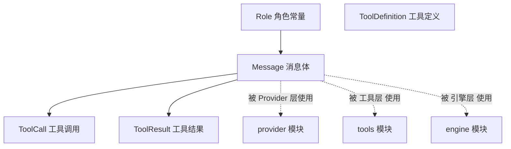

# Schema 层 — 数据契约模块

> 源码路径：`internal/schema/message.go`

## 模块简介

Schema 层是整个 `go-my-harness` 框架的**数据契约基石**。它定义了 Agent 系统中所有核心数据结构：消息（Message）、工具调用（ToolCall）、工具结果（ToolResult）以及工具定义（ToolDefinition）。这些结构被 [Provider 层](provider.md)、[工具层](tools.md)、[引擎层](engine.md) 共同依赖，是各模块之间通信的「通用语言」。

## 架构概览



## 核心组件

### Role — 消息角色枚举

`Role` 是一个字符串类型，定义了与大模型通信时消息的三种角色：

| 常量 | 值 | 用途 |
|------|----|------|
| `RoleSystem` | `"system"` | 系统提示词，确立 Agent 的性格与红线 |
| `RoleUser` | `"user"` | 用户输入 / 工具执行的返回结果（Observation）|
| `RoleAssistant` | `"assistant"` | 模型输出，包含推理或工具调用 |

### Message — 上下文消息体

`Message` 代表上下文中传递的单条消息，是整个对话历史的基本单元：

```go
type Message struct {
    Role       Role     `json:"role"`
    Content    string   `json:"content"`
    ToolCalls  []ToolCall `json:"tool_calls,omitempty"`
    ToolCallID string   `json:"tool_call_id,omitempty"`
}
```

**设计要点**：
- `ToolCalls` 支持并行调用多个工具，模型可在一次响应中请求执行多个操作。
- `ToolCallID` 用于关联工具响应与原始调用，维持大模型的逻辑链完整性。
- `omitempty` 标签确保序列化时省略空字段，减少 token 消耗。

### ToolCall — 工具调用请求

```go
type ToolCall struct {
    ID        string          `json:"id"`
    Name      string          `json:"name"`
    Arguments json.RawMessage `json:"arguments"`
}
```

**关键设计**：`Arguments` 使用 `json.RawMessage` 类型而非 `map[string]interface{}`，实现**延迟解析**。这意味着 JSON 参数以原始字节流传递，具体的反序列化责任交给各个工具内部处理。这样做的好处是：

1. 避免全局统一参数结构，每个工具可以自定义参数 schema。
2. 减少不必要的序列化/反序列化开销。
3. 工具可以按需提取自己关心的字段。

### ToolResult — 工具执行结果

```go
type ToolResult struct {
    ToolCallID string `json:"tool_call_id"`
    Output     string `json:"output"`
    IsError    bool   `json:"is_error"`
}
```

`IsError` 字段是**驾驭工程**的关键：当工具执行失败时，错误信息不会以 Go `error` 形式抛出中断流程，而是封装为 `ToolResult` 返回给大模型，让模型基于错误信息进行**自纠错（Self-Correction）**。

### ToolDefinition — 工具元信息

```go
type ToolDefinition struct {
    Name        string      `json:"name"`
    Description string      `json:"description"`
    InputSchema interface{} `json:"input_schema"`
}
```

`InputSchema` 使用 `interface{}` 类型，对应 JSON Schema 规范。各工具在 `Definition()` 方法中以 `map[string]interface{}` 形式构建参数 schema，提交给大模型理解工具的用途和参数格式。

## 与其他模块的关联

- **被 [Provider 层](provider.md) 依赖**：Provider 在 `Generate()` 方法中接收 `[]Message` 和 `[]ToolDefinition`，并将内部 schema 翻译为各 LLM 厂商的专有格式。
- **被 [工具层](tools.md) 依赖**：`BaseTool` 接口的 `Definition()` 返回 `ToolDefinition`，`Registry.Execute()` 接收 `ToolCall` 并返回 `ToolResult`。
- **被 [引擎层](engine.md) 依赖**：`AgentEngine.Run()` 维护 `[]Message` 作为上下文历史，在 Thinking 和 Action 阶段调用 Provider，在 Observation 阶段收集工具结果。

## 设计哲学

Schema 层体现了框架的**解耦思想**：通过定义一套与具体 LLM 厂商无关的通用数据结构，使得上层引擎逻辑无需关心底层是 OpenAI、Anthropic 还是其他兼容 API。所有厂商差异都被封装在 [Provider 层](provider.md) 的翻译逻辑中。