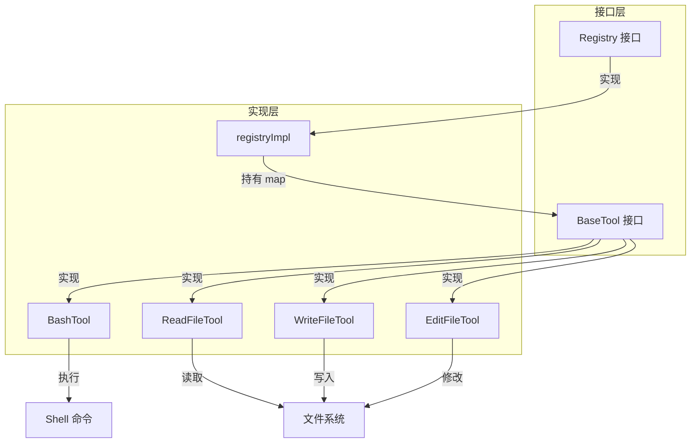

# 工具层 — 工具注册与执行模块

> 源码路径：`internal/tools/`

## 模块简介

工具层是 `go-my-harness` 框架的**执行能力中心**。它定义了 `BaseTool` 接口和 `Registry` 注册表，实现了大模型与物理世界交互的桥梁。当前内置四款工具：`bash`（命令执行）、`read_file`（文件读取）、`write_file`（文件写入）、`edit_file`（文件编辑）。所有工具均受工作区（WorkDir）约束，并内置多重安全防线。

## 架构概览



## 核心组件

### BaseTool 接口 — `registry.go`

所有具体工具必须实现的通用接口：

```go
type BaseTool interface {
    Name() string
    Definition() schema.ToolDefinition
    Execute(ctx context.Context, args json.RawMessage) (string, error)
}
```

- `Name()`：返回工具的全局唯一名称，大模型通过此名称调用工具。
- `Definition()`：返回提交给大模型的工具元信息和参数 JSON Schema。
- `Execute()`：接收大模型吐出的 JSON 参数（`json.RawMessage`），执行具体业务逻辑。反序列化由各工具内部自行处理。

### Registry 接口与实现 — `registry.go`

`Registry` 定义了工具的注册与分发接口：

```go
type Registry interface {
    Register(tool BaseTool)
    GetAvailableTools() []schema.ToolDefinition
    Execute(ctx context.Context, call schema.ToolCall) schema.ToolResult
}
```

`registryImpl` 是默认实现，使用 `map[string]BaseTool` 以工具名称为 Key 进行 O(1) 路由查找。

**Execute 方法的路由流程**：

1. **路由查找**：若找不到工具（模型幻觉），返回带 `IsError=true` 的 `ToolResult`，模型看到后会尝试纠正。
2. **执行工具**：将原始 JSON 字节流直接传递给具体工具。
3. **封装结果**：将执行结果或底层物理错误封装为 `ToolResult` 返回。

### BashTool — `bash.go`

在当前工作区执行任意 bash/powershell 命令。

**四重驾驭底线**：

| 底线 | 机制 | 说明 |
|------|------|------|
| 时间预算 | 30 秒超时 | 防止模型卡死进程（如运行 top 或常驻服务）|
| 工作区绑定 | `cmd.Dir = t.workDir` | 确保命令在指定 WorkDir 下执行 |
| 错误原样回传 | 不返回 Go error | 将 stderr 拼接为字符串返回，利用模型自纠错 |
| 长度截断 | 8000 字节上限 | 防止 OOM，超长输出自动截断 |

**跨平台支持**：Windows 环境使用 `powershell -NoProfile -NonInteractive`，macOS/Linux 使用 `bash -c`。

### ReadFileTool — `read_file.go`

读取指定路径的文件内容，限制在 WorkDir 下操作。

**核心防线**：长度截断保护（8000 字节），防止大模型读取超大日志文件导致 Context 爆炸。

```go
const maxLen = 8000
if len(content) > maxLen {
    truncatedMsg := fmt.Sprintf("%s\n\n...[截断至前 %d 字节]...",
        string(content[:maxLen]), maxLen)
    return truncatedMsg, nil
}
```

### WriteFileTool — `write_file.go`

创建或覆盖写入文件，自动创建缺失的父级目录。

**安全防线**：通过 `filepath.Join(t.workDir, input.Path)` 限制在 WorkDir 下执行，防止大模型修改系统级文件。文件权限设为 0644，父目录权限 0755。

### EditFileTool — `edit_file.go`

对现有文件进行局部字符串替换，比重写整个文件更安全、更快速。

**四级模糊匹配策略** (`fuzzyReplace`)：

| 层级 | 策略 | 说明 |
|------|------|------|
| L1 | 精确匹配 | 完全一致的字符串匹配 |
| L2 | 统一换行符 | 将 `\r\n` 统一为 `\n` 后匹配 |
| L3 | 去首尾空白 | `TrimSpace` 后匹配 |
| L4 | 逐行去空格 | 逐行 `TrimSpace` 后模糊匹配 |

**多重匹配保护**：当匹配到多处时返回错误，要求模型提供更多上下文以精确定位。这有效防止了误修改。

## 与其他模块的关联

- **依赖 [Schema 层](schema.md)**：使用 `ToolDefinition`、`ToolCall`、`ToolResult` 等数据结构。
- **被 [引擎层](engine.md) 依赖**：`AgentEngine` 持有 `Registry`，在 Action 阶段调用 `GetAvailableTools()` 获取工具列表，在 Observation 阶段并发调用 `Execute()` 执行工具。
- **被 [入口层](entry.md) 依赖**：`main()` 创建 `Registry` 并注册四款工具。

## 设计哲学

工具层体现了框架的**可扩展性**与**安全优先**原则：

1. **插件化架构**：新增工具只需实现 `BaseTool` 接口并调用 `Register()`，无需修改引擎逻辑。
2. **防御性编程**：每个工具都内置工作区约束、超时控制、长度截断等多重防线，防止大模型的「野蛮操作」破坏系统。
3. **自愈机制**：工具执行错误不中断流程，而是以文本形式回传给模型，让模型自主分析报错并调整策略。