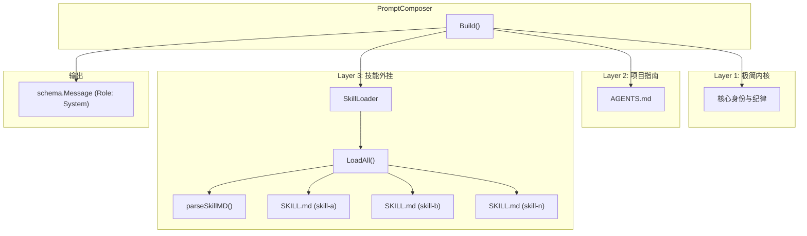
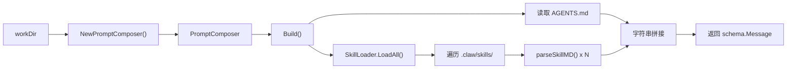
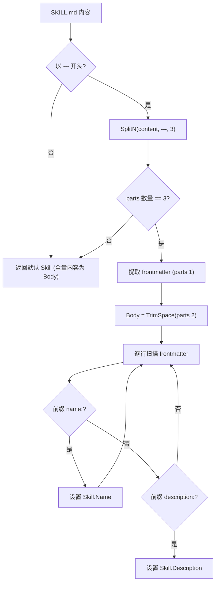

# 上下文管理模块

## 模块简介

上下文管理模块（`internal/context`）是 go-my-harness AI Agent 框架的**提示词组装引擎**，负责在每次 Agent 调用前，将分散在不同来源的上下文信息动态聚合为一条完整的系统提示词（System Prompt）。

该模块采用**三层渐进式上下文加载**架构：

1. **极简内核** -- 硬编码的 Agent 身份与核心纪律，作为所有会话的基座
2. **项目专属指南** -- 从工作区根目录的 `AGENTS.md` 文件热加载项目级规范
3. **技能外挂系统** -- 从 `.claw/skills/` 目录递归扫描并解析 `SKILL.md` 技能文件，动态注入可复用能力

这种设计使得 Agent 的行为既保持一致的底线纪律，又能根据不同项目和技能配置灵活适配，实现了"内核稳定、外围可扩展"的上下文管理策略。

---

## 架构图



---

## 数据流



---

## 核心组件详解

### [PromptComposer](../internal/context/composer.go) -- 提示词组装器

`PromptComposer` 是本模块的入口结构体，也是对外暴露的唯一编排器。它将工作目录（`workDir`）作为根路径，协调内核提示词、项目指南和技能加载三个层次，最终产出一条完整的系统消息。

#### 结构定义

```go
type PromptComposer struct {
    workDir     string
    skillLoader *SkillLoader
}
```

| 字段 | 类型 | 说明 |
|------|------|------|
| `workDir` | `string` | 当前工作区的根目录路径，用于定位 `AGENTS.md` 和 `.claw/skills/` |
| `skillLoader` | `*SkillLoader` | 内嵌的技能加载器实例，在构造时自动创建 |

#### NewPromptComposer -- 构造函数

```go
func NewPromptComposer(workDir string) *PromptComposer
```

构造函数接收一个工作目录路径，自动创建并内嵌一个 `SkillLoader` 实例。这是创建 `PromptComposer` 的唯一推荐方式。

**使用示例：**

```go
composer := NewPromptComposer("/path/to/workspace")
systemMsg := composer.Build()
// systemMsg.Role == schema.RoleSystem
// systemMsg.Content 包含完整的系统提示词
```

#### Build -- 构建系统提示词

```go
func (c *PromptComposer) Build() schema.Message
```

`Build` 是模块的核心方法，按固定顺序执行三层上下文拼接：

| 顺序 | 层次 | 来源 | 容错策略 |
|------|------|------|----------|
| 1 | 极简内核 | 硬编码字符串 | 无（始终写入） |
| 2 | 项目指南 | `{workDir}/AGENTS.md` | 文件不存在则静默跳过 |
| 3 | 技能外挂 | `SkillLoader.LoadAll()` | 目录不存在或内容为空则静默跳过 |

**返回值**：一个 `schema.Message` 结构体，其中 `Role` 设为 `schema.RoleSystem`，`Content` 为拼接后的完整提示词文本。

---

### [Skill](../internal/context/skill.go) -- 技能数据结构

`Skill` 是一个纯数据载体结构体，表示从单个 `SKILL.md` 文件中解析出的技能元信息。

#### 结构定义

```go
type Skill struct {
    Name        string
    Description string
    Body        string
}
```

| 字段 | 类型 | 说明 |
|------|------|------|
| `Name` | `string` | 技能名称，来自 YAML frontmatter 的 `name:` 字段 |
| `Description` | `string` | 技能描述（触发条件），来自 YAML frontmatter 的 `description:` 字段 |
| `Body` | `string` | Markdown 正文指令，即 frontmatter 之后的全部内容 |

**默认值**：当解析失败或 frontmatter 缺失时，`Name` 默认为 `"Unknown Skill"`，`Description` 默认为 `"No description provided."`，`Body` 默认为文件的全量内容。

---

### [SkillLoader](../internal/context/skill.go) -- 技能加载器

`SkillLoader` 负责从工作区的 `.claw/skills/` 目录中递归发现并加载所有技能定义文件。

#### 结构定义

```go
type SkillLoader struct {
    workDir string
}
```

| 字段 | 类型 | 说明 |
|------|------|------|
| `workDir` | `string` | 工作区根路径，技能目录基于此路径推算 |

#### NewSkillLoader -- 构造函数

```go
func NewSkillLoader(workDir string) *SkillLoader
```

接收工作目录路径，返回一个新的 `SkillLoader` 实例。通常不需要直接调用此构造函数，因为 `NewPromptComposer` 会自动创建。

#### LoadAll -- 批量加载技能

```go
func (s *SkillLoader) LoadAll() string
```

`LoadAll` 是技能加载的核心方法，执行以下流程：

1. **路径计算**：拼接出技能目录路径 `{workDir}/.claw/skills/`
2. **存在性检查**：如果目录不存在，静默返回空字符串（不报错）
3. **递归遍历**：使用 `filepath.WalkDir` 递归扫描，仅处理文件名为 `SKILL.md` 的文件
4. **逐个解析**：对每个 `SKILL.md` 调用 `parseSkillMD()` 提取结构化信息
5. **格式化输出**：将每个技能按固定模板格式化为 Markdown 片段并拼接
6. **最小内容校验**：如果总拼接长度不足 100 字符，视为无有效技能，返回空字符串

**返回格式示例**（单个技能片段）：

```markdown
### 可用专业技能 (Agent Skills)
以下是你拥有的标准化外挂技能，请在符合 description 描述的场景下严格遵循其正文指令：

#### 技能名称: code-review
**触发条件**: 当用户要求对代码进行审查或 Review 时触发

**执行指南**:
<SKILL.md 正文内容>

---
```

---

### parseSkillMD -- SKILL.md 解析器

```go
func parseSkillMD(content string) Skill
```

`parseSkillMD` 是一个内部辅助函数，负责解析 `SKILL.md` 文件内容，提取 YAML frontmatter 元数据和 Markdown 正文。

#### 解析算法



#### SKILL.md 文件格式规范

一个标准的 `SKILL.md` 文件应遵循如下格式：

```markdown
---
name: skill-name
description: 该技能的触发条件和用途描述
---

# 技能正文

这里是具体的执行指南和指令...
```

**解析规则**：

| 部分 | 解析方式 | 说明 |
|------|----------|------|
| Frontmatter 起始 | 必须以 `---\n` 或 `---\r\n` 开头 | 否则视为无 frontmatter |
| 分割 | `strings.SplitN(content, "---", 3)` | 取第二段为元数据，第三段为正文 |
| `name` 提取 | 行前缀匹配 `name:` | 简单字符串前缀匹配，非完整 YAML 解析 |
| `description` 提取 | 行前缀匹配 `description:` | 同上 |
| Body | `strings.TrimSpace(parts[2])` | 去除正文首尾空白 |

**注意事项**：该解析器采用轻量级实现，不支持多行 YAML 值、嵌套结构或引号转义。如需更复杂的元数据，建议扩展此解析器或引入标准 YAML 库。

---

## 目录结构

本模块在工作区中依赖以下文件系统布局：

```
{workDir}/
+-- AGENTS.md                  # [可选] 项目专属指南
+-- .claw/
    +-- skills/
        +-- skill-a/
        |   +-- SKILL.md       # 技能定义文件
        +-- skill-b/
            +-- SKILL.md       # 技能定义文件
```

---

## 设计决策与模式

### 1. 三层渐进加载

模块将上下文分为三个优先级层次，确保核心身份始终存在，同时允许项目级和技能级定制：

- **L1 内核**（硬编码）：保证 Agent 在所有场景下都具备一致的行为底线
- **L2 项目**（AGENTS.md）：允许每个工作区定义特定的架构规范和约束
- **L3 技能**（SKILL.md）：提供可插拔的能力扩展，按需加载

### 2. 静默容错

所有外部文件加载均采用"存在则使用，不存在则静默跳过"的策略。这保证了：
- 没有 `AGENTS.md` 的项目依然可以正常运行
- 没有 `.claw/skills/` 目录的工作区不会触发错误
- 单个 `SKILL.md` 解析失败不影响其他技能的加载

### 3. 外部化状态管理

通过将项目规范和技能定义外部化为 Markdown 文件，而非硬编码在 Go 源码中，实现了：
- **热更新**：修改 `AGENTS.md` 或 `SKILL.md` 后，下次 `Build()` 调用即可生效
- **版本控制**：这些文件可以纳入 Git 管理，实现团队协作
- **非程序员友好**：业务人员可以直接编辑 Markdown 来调整 Agent 行为

### 4. 最小内容阈值

`LoadAll()` 方法在最终返回前检查拼接结果是否达到 100 字符的最小阈值。这避免了在技能目录存在但内容全部为空或无效时，注入无意义的上下文噪声。

---

## 与其他模块的关系

- [引擎核心](引擎核心.md) -- `PromptComposer.Build()` 产出的 `schema.Message` 直接作为 Agent 的系统提示词输入
- [工具系统](工具系统.md) -- 内核提示词中引用了 `write_file`、`read_file` 等内置工具，与工具系统模块定义的工具集对应
- [LLM提供者](LLM提供者.md) -- `workDir` 路径由上层配置管理模块传入，决定了上下文加载的根目录
- [引擎核心](引擎核心.md) -- 输出类型为 `schema.Message`，遵循框架统一的消息模型定义

---

## 扩展指南

### 添加新技能

1. 在工作区创建目录 `.claw/skills/<your-skill-name>/`
2. 在该目录下创建 `SKILL.md` 文件
3. 按以下格式编写：

```markdown
---
name: your-skill-name
description: 描述该技能在什么场景下触发
---

# 执行指南

具体的指令内容...
```

### 自定义项目指南

在工作区根目录创建或编辑 `AGENTS.md`，写入项目特有的架构规范和注意事项。Agent 会在每次 `Build()` 时自动加载该文件内容。

### 扩展 frontmatter 字段

如需在 `SKILL.md` 中支持更多元数据字段（如 `version`、`author`、`tags` 等），需要修改 `parseSkillMD()` 函数，在逐行扫描循环中添加新的前缀匹配分支，并相应扩展 `Skill` 结构体。


<!-- crosslinks (auto-generated) -->
## Related Modules
- Depends on: [工具系统](工具系统.md)
- Used by: [引擎核心](引擎核心.md), [飞书集成](飞书集成.md)
