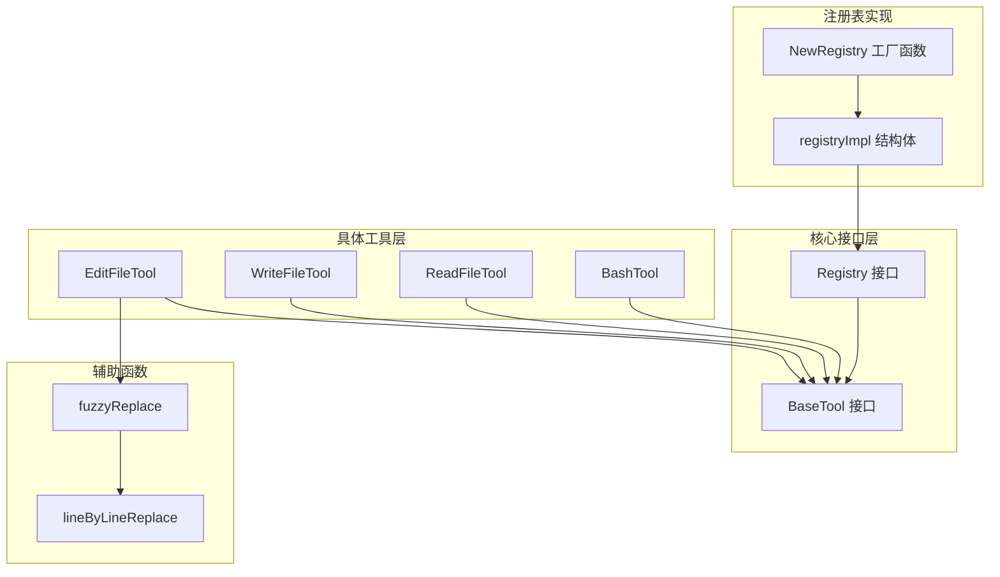
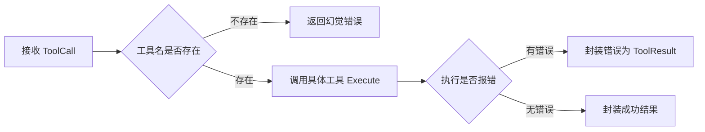
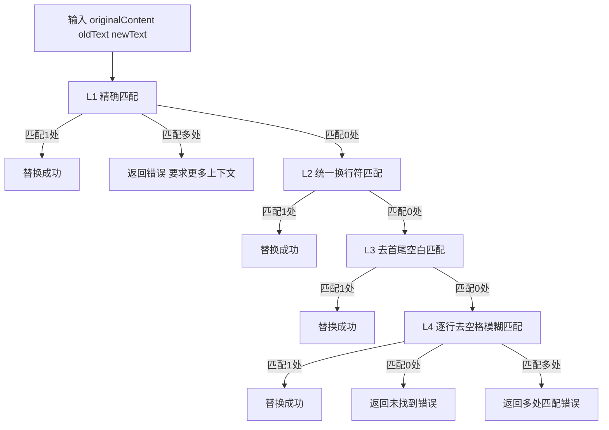
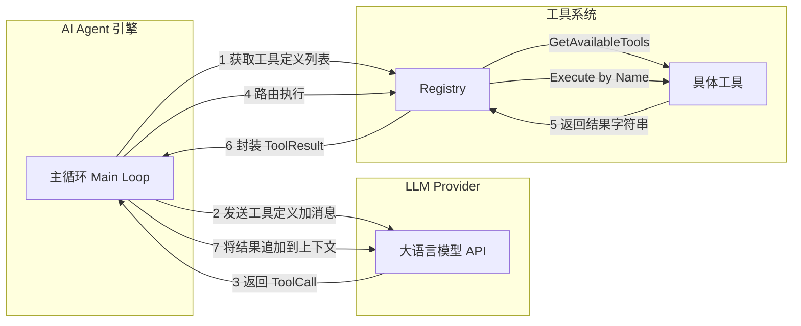

# 工具系统 (Tools System)

## 模块简介

工具系统是 go-my-harness AI Agent 框架的核心基础设施模块，位于 `internal/tools/` 包下。它为大语言模型 (LLM) 提供了一套与物理世界交互的标准化工具集合，使 AI Agent 能够执行 Bash 命令、读写文件、编辑代码等操作。

该模块采用**接口驱动 + 注册表路由**的架构模式，通过 `BaseTool` 接口定义工具契约，通过 `Registry` 实现工具的注册、发现和调用路由。这种设计使得框架具备良好的可扩展性 -- 新增工具只需实现接口并注册即可，无需修改引擎核心代码。

## 架构总览



## 核心接口

### [BaseTool](../internal/tools/registry.go) 接口

`BaseTool` 是所有具体工具必须实现的接口，定义了工具的三个核心能力：

```go
type BaseTool interface {
    // Name 返回工具的全局唯一名称 (大模型通过这个名字调用它)
    Name() string

    // Definition 返回用于提交给大模型的工具元信息和参数 JSON Schema
    Definition() schema.ToolDefinition

    // Execute 接收大模型吐出的 JSON 参数，执行具体业务逻辑
    Execute(ctx context.Context, args json.RawMessage) (string, error)
}
```

**设计要点：**

| 方法 | 职责 | 说明 |
|------|------|------|
| `Name()` | 身份标识 | 返回全局唯一的工具名称，作为注册表中的路由键 |
| `Definition()` | 元信息声明 | 返回 JSON Schema 格式的参数定义，供 LLM 理解工具的用法 |
| `Execute()` | 业务执行 | 接收原始 JSON 参数（`json.RawMessage`），反序列化由各工具内部自行处理 |

参数使用 `json.RawMessage` 而非具体结构体，实现了接口层与具体参数类型的解耦，每个工具可以定义自己的参数结构体（如 `bashArgs`、`readFileArgs` 等）。

### [Registry](../internal/tools/registry.go) 接口

`Registry` 定义了工具注册表的标准操作接口，是连接 AI Agent 引擎与具体工具的桥梁：

```go
type Registry interface {
    // Register 挂载一个新的工具到系统中
    Register(tool BaseTool)

    // GetAvailableTools 返回当前系统挂载的所有工具的 Schema
    GetAvailableTools() []schema.ToolDefinition

    // Execute 实际路由并执行模型请求的工具调用
    Execute(ctx context.Context, call schema.ToolCall) schema.ToolResult
}
```

**三个核心操作：**

1. **Register** -- 在系统启动阶段将工具实例挂载到注册表
2. **GetAvailableTools** -- 在每次 LLM 请求前收集所有工具的定义信息
3. **Execute** -- 在 LLM 返回工具调用指令时进行路由分发和执行

## 注册表实现

### registryImpl 结构体

`registryImpl` 是 `Registry` 接口的默认实现，使用 `map[string]BaseTool` 作为底层存储：

```go
type registryImpl struct {
    tools map[string]BaseTool
}
```

### NewRegistry 工厂函数

```go
func NewRegistry() Registry {
    return &registryImpl{
        tools: make(map[string]BaseTool),
    }
}
```

返回 `Registry` 接口类型而非具体实现，遵循面向接口编程原则。

### Register -- 工具注册

```go
func (r *registryImpl) Register(tool BaseTool)
```

- 以工具的 `Name()` 作为 map 的 key 进行存储，实现 O(1) 查找
- 支持同名覆盖注册，但会输出警告日志
- 每次注册成功都会输出挂载日志

### GetAvailableTools -- 获取工具定义列表

```go
func (r *registryImpl) GetAvailableTools() []schema.ToolDefinition
```

遍历注册表中的所有工具，收集各自的 `Definition()` 并返回。该方法通常在构建 LLM API 请求时调用，将工具定义信息传递给模型。

### Execute -- 路由与执行

```go
func (r *registryImpl) Execute(ctx context.Context, call schema.ToolCall) schema.ToolResult
```

这是工具系统中最关键的运行时方法，其执行流程如下：



**关键设计决策：**

- **幻觉检测**：当 LLM 调用一个不存在的工具名时，返回 `IsError: true` 的结果，模型会自动尝试纠正
- **错误透传**：底层工具返回的 Go error 会被封装为字符串放入 `ToolResult.Output`，而非直接向上层抛出异常
- **结果标准化**：无论成功还是失败，都统一封装为 `schema.ToolResult` 结构返回

## 具体工具

### [BashTool](../internal/tools/bash.go) -- 命令执行工具

**文件**：`internal/tools/bash.go`

[BashTool](../internal/tools/bash.go) 允许 AI Agent 在当前工作区执行任意的 bash 命令，是 Agent 与操作系统交互的主要手段。

#### 结构体定义

```go
type BashTool struct {
    workDir string // 工作区约束
}
```

#### 构造函数

```go
func NewBashTool(workDir string) *BashTool
```

#### 工具定义

- **名称**：`bash`
- **描述**：在当前工作区执行任意的 bash 命令，支持链式命令（如 `&&`）
- **参数**：`command`（string，必填）-- 要执行的 bash 命令

#### Execute 方法与四大安全防线

[BashTool](../internal/tools/bash.go) 的 `Execute` 方法实现了四道安全防线，体现了框架「驾驭 AI」的设计理念：

| 防线 | 机制 | 目的 |
|------|------|------|
| **Time Budgeting** | 30 秒超时控制 (`context.WithTimeout`) | 防止大模型卡死进程（如运行 `top` 或启动常驻服务） |
| **工作区绑定** | `cmd.Dir = t.workDir` | 确保命令在用户指定的目录下执行 |
| **错误原样回传** | 命令报错时不返回 Go error，而是将错误信息拼入字符串 | 利用大模型的自纠错 (Self-Correction) 能力分析报错 |
| **输出截断** | 超过 8000 字节自动截断 | 防止大量终端输出导致 Context 溢出 (OOM) |

**跨平台支持**：

```go
if runtime.GOOS == "windows" {
    cmd = exec.CommandContext(timeoutCtx, "powershell", "-NoProfile", "-NonInteractive", "-Command", input.Command)
} else {
    cmd = exec.CommandContext(timeoutCtx, "bash", "-c", input.Command)
}
```

Windows 环境自动切换为 PowerShell 执行，并使用 `-NoProfile` 避免用户脚本干扰。

### [ReadFileTool](../internal/tools/read_file.go) -- 文件读取工具

**文件**：`internal/tools/read_file.go`

[ReadFileTool](../internal/tools/read_file.go) 用于读取指定路径的文件内容，是 Agent 理解代码库的基础工具。

#### 结构体定义

```go
type ReadFileTool struct {
    workDir string // 将引擎的 WorkDir 注入给工具，限制操作范围
}
```

#### 构造函数

```go
func NewReadFileTool(workDir string) *ReadFileTool
```

#### 工具定义

- **名称**：`read_file`
- **描述**：读取指定路径的文件内容，请提供相对工作区的路径
- **参数**：`path`（string，必填）-- 要读取的文件路径

#### Execute 方法

```go
func (t *ReadFileTool) Execute(ctx context.Context, args json.RawMessage) (string, error)
```

执行流程：

1. 解析 JSON 参数为 `readFileArgs` 结构体
2. 将相对路径与 `workDir` 拼接为绝对路径
3. 打开文件并读取全部内容
4. 进行 8000 字节截断保护，防止大文件撑爆 LLM 上下文窗口

### [WriteFileTool](../internal/tools/write_file.go) -- 文件写入工具

**文件**：`internal/tools/write_file.go`

[WriteFileTool](../internal/tools/write_file.go) 用于创建新文件或覆盖现有文件的内容。

#### 结构体定义

```go
type WriteFileTool struct {
    workDir string // 工作区约束
}
```

#### 构造函数

```go
func NewWriteFileTool(workDir string) *WriteFileTool
```

#### 工具定义

- **名称**：`write_file`
- **描述**：创建或覆盖写入一个文件，目录不存在会自动创建
- **参数**：
  - `path`（string，必填）-- 要写入的文件路径
  - `content`（string，必填）-- 要写入的完整文件内容

#### Execute 方法

```go
func (t *WriteFileTool) Execute(ctx context.Context, args json.RawMessage) (string, error)
```

核心特性：

- **自动创建目录**：通过 `os.MkdirAll` 自动创建缺失的父级目录
- **安全约束**：路径拼接限制在 `workDir` 下，防止修改系统级文件
- **权限控制**：写入文件权限设为 `0644`，目录权限设为 `0755`

### [EditFileTool](../internal/tools/edit_file.go) -- 文件编辑工具

**文件**：`internal/tools/edit_file.go`

[EditFileTool](../internal/tools/edit_file.go) 对现有文件进行局部的字符串替换，比 [WriteFileTool](../internal/tools/write_file.go) 重写整个文件更安全、更精确。

#### 结构体定义

```go
type EditFileTool struct {
    workDir string
}
```

#### 构造函数

```go
func NewEditFileTool(workDir string) *EditFileTool
```

#### 工具定义

- **名称**：`edit_file`
- **描述**：对现有文件进行局部的字符串替换
- **参数**：
  - `path`（string，必填）-- 要修改的文件路径
  - `old_text`（string，必填）-- 文件中原有的文本，需包含足够上下文确保唯一性
  - `new_text`（string，必填）-- 要替换成的新文本

#### Execute 方法

```go
func (t *EditFileTool) Execute(ctx context.Context, args json.RawMessage) (string, error)
```

执行流程：读取文件 -> 调用 `fuzzyReplace` 进行模糊替换 -> 写回文件。

## 模糊替换算法

[EditFileTool](../internal/tools/edit_file.go) 的核心竞争力在于其多级模糊替换策略，由 `fuzzyReplace` 函数实现。该函数采用逐级放宽匹配条件的策略，力求在各种边界情况下都能成功定位并替换目标代码。

### 四级匹配策略



**各层级详细说明：**

| 层级 | 策略 | 解决的问题 |
|------|------|-----------|
| **L1** | 直接 `strings.Count` 精确匹配 | 标准情况，文本完全一致 |
| **L2** | 将 `\r\n` 统一为 `\n` 后匹配 | 跨平台换行符差异（Windows vs Unix） |
| **L3** | 对 `oldText` 做 `TrimSpace` 后匹配 | 首尾多余空白或空行的情况 |
| **L4** | `lineByLineReplace` 逐行去空格比较 | 缩进不一致的情况（如 Tab vs Space） |

### lineByLineReplace 逐行匹配

`lineByLineReplace` 是最底层的兜底匹配策略：

```go
func lineByLineReplace(content, oldText, newText string) (string, error)
```

**算法流程：**

1. 将文件内容和目标文本按 `\n` 拆分为行数组
2. 对 `oldText` 的每一行去除首尾空格（`TrimSpace`）
3. 在文件内容中滑动窗口，逐行对比（同样 `TrimSpace` 后比较）
4. 统计匹配次数：
   - 0 处匹配：返回「未找到」错误，提示先调用 `read_file` 确认内容
   - 1 处匹配：执行替换
   - 多处匹配：返回错误，要求提供更多上下文以精确定位

## 工具调用数据流

以下展示了一次完整的工具调用从 LLM 决策到执行结果返回的全链路数据流：



## 安全设计

工具系统在多个层面实施了安全防护策略：

### 工作区隔离

所有工具（`BashTool`、`ReadFileTool`、`WriteFileTool`、`EditFileTool`）都通过构造函数注入 `workDir`，将文件操作限制在指定的工作区目录内。

```go
// 每个工具都持有 workDir 引用
fullPath := filepath.Join(t.workDir, input.Path)
```

### 超时控制

[BashTool](../internal/tools/bash.go) 使用 `context.WithTimeout` 实施 30 秒硬超时：

```go
timeoutCtx, cancel := context.WithTimeout(ctx, 30*time.Second)
defer cancel()
```

超时后系统会强制终止进程，并向 LLM 返回警告信息。

### 输出截断

[BashTool](../internal/tools/bash.go) 和 [ReadFileTool](../internal/tools/read_file.go) 均实施 8000 字节的输出截断保护：

```go
const maxLen = 8000
if len(outputStr) > maxLen {
    return fmt.Sprintf("%s\n\n...[截断提示]...", outputStr[:maxLen]), nil
}
```

这一机制防止大文件或长命令输出撑爆 LLM 的上下文窗口。

### 错误自愈

[BashTool](../internal/tools/bash.go) 的命令执行错误不会以 Go error 形式向上传播，而是将错误信息拼接到返回字符串中：

```go
if err != nil {
    return fmt.Sprintf("执行报错: %v\n输出:\n%s", err, outputStr), nil
}
```

这种设计利用 LLM 的自纠错能力，让模型自行分析报错原因并尝试修复。

## 扩展指南

新增一个工具只需三步：

1. **定义结构体**，持有必要的依赖（如 `workDir`）
2. **实现 `BaseTool` 接口**的三个方法：`Name()`、`Definition()`、`Execute()`
3. **注册到 [Registry](../internal/tools/registry.go)**

```go
// 示例：新增一个 list_files 工具
type ListFilesTool struct {
    workDir string
}

func NewListFilesTool(workDir string) *ListFilesTool {
    return &ListFilesTool{workDir: workDir}
}

func (t *ListFilesTool) Name() string { return "list_files" }

func (t *ListFilesTool) Definition() schema.ToolDefinition {
    return schema.ToolDefinition{
        Name:        t.Name(),
        Description: "列出指定目录下的文件和子目录",
        InputSchema: map[string]interface{}{ /* JSON Schema */ },
    }
}

func (t *ListFilesTool) Execute(ctx context.Context, args json.RawMessage) (string, error) {
    // 实现具体逻辑
}

// 注册
registry.Register(NewListFilesTool(workDir))
```

## 与其他模块的关系

- **[引擎核心](引擎核心.md)**：主循环 (Main Loop) 调用 [Registry](../internal/tools/registry.go) 的 `GetAvailableTools()` 和 `Execute()` 方法驱动工具系统
- **[LLM 提供者](LLM提供者.md)**：工具定义 (`ToolDefinition`) 和工具调用结果 (`ToolResult`) 是 Provider 与引擎之间通信的数据结构
- **[引擎核心](引擎核心.md)**：`schema.ToolDefinition`、`schema.ToolCall`、`schema.ToolResult` 等数据结构定义在 schema 包中


<!-- crosslinks (auto-generated) -->
## Related Modules
- Used by: [上下文管理](上下文管理.md), [应用入口](应用入口.md), [引擎核心](引擎核心.md)
