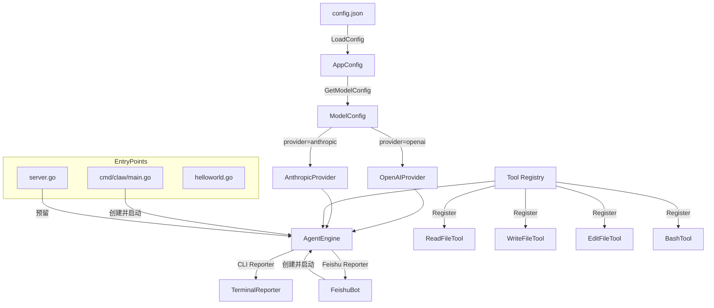
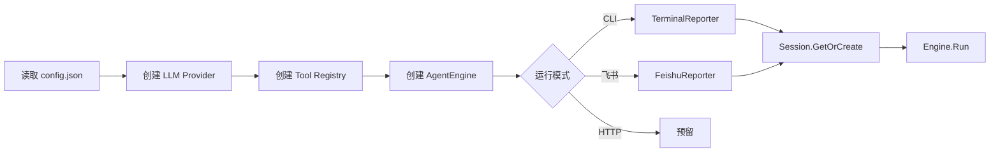

# 应用入口

## 模块简介

应用入口模块是 go-my-harness 项目的启动层，提供了三种不同的运行模式入口：CLI 命令行模式（`cmd/claw/main.go`）、HTTP 服务器模式（`server.go`）和最小可运行示例（`helloworld.go`）。同时，通过子模块[飞书集成](飞书集成.md)支持飞书机器人作为交互前端。

该模块本身不包含业务逻辑，而是负责：组装各子系统组件（LLM Provider、工具注册表、Agent 引擎）、加载配置、选择运行模式并启动 Agent 循环。

## 核心功能

| 入口 | 文件 | 运行模式 | 说明 |
|------|------|----------|------|
| CLI 模式 | `cmd/claw/main.go` | 终端交互 | 完整功能入口：加载配置 → 创建 Provider → 注册工具 → 启动引擎，支持多会话并发测试 |
| 服务器模式 | `server.go` | HTTP 服务 | 预留的 HTTP 服务入口，监听 8080 端口（当前为占位实现） |
| 最小示例 | `helloworld.go` | 单文件可运行 | 项目脚手架，最简 Go 入口 |
| 飞书模式 | `internal/feishu/` | 飞书机器人 | 通过 WebSocket/HTTP 接收飞书消息，驱动 Agent 执行（详见子模块文档） |

## 架构图



## 入口详解

### CLI 模式 (`cmd/claw/main.go`)

CLI 是项目的主力运行入口，实现了完整的 Agent 生命周期管理：

```go
func main() {
    // 1. 从 config.json 加载应用配置
    cfg, _ := provider.LoadConfig(configPath)
    mc, modelName, _ := cfg.GetModelConfig("")
    
    // 2. 根据 provider 类型创建 LLM Provider
    switch mc.Provider {
    case "openai":
        llmProvider = provider.NewOpenAIProvider(mc.APIKey, mc.BaseURL, modelName)
    case "anthropic":
        llmProvider = provider.NewAnthropicProvider(mc.APIKey, mc.BaseURL, modelName)
    }
    
    // 3. 创建工具注册表并绑定工作区
    registry := tools.NewRegistry()
    registry.Register(tools.NewReadFileTool(workDir))
    
    // 4. 创建引擎并启动
    eng := engine.NewAgentEngine(llmProvider, registry, false)
    session := engine.GlobalSessionMgr.GetOrCreate(sessionId, workDir)
    eng.Run(ctx, session, reporter)
}
```

**核心设计：**

- **配置驱动**：通过 [LLM提供者](LLM提供者.md) 模块的 `LoadConfig` 从 `config.json` 读取模型配置，支持多模型切换
- **Provider 工厂模式**：根据 `provider` 字段动态创建 OpenAI 或 Anthropic 提供者
- **工作区绑定**：工具注册表绑定到特定工作区目录，实现文件操作的物理隔离
- **并发测试**：支持多 Goroutine 模拟不同群聊的并发 [Session](../internal/engine/session.go) 测试

### 服务器模式 (`server.go`)

当前为占位实现，预留了 HTTP 服务的入口框架：

```go
func main() {
    fmt.Println("Server is starting on port 8080...")
    // TODO: 增加鉴权逻辑
}
```

**演进方向：** 计划作为 API 网关，接受外部 HTTP 请求后创建 [Session](../internal/engine/session.go) 并驱动 Agent 执行，类似飞书集成但面向通用 HTTP 客户端。

### 最小示例 (`helloworld.go`)

最简可运行的 Go 程序，用于项目初始化和脚手架验证。

## 子模块

### [飞书集成](飞书集成.md)

飞书集成模块（`internal/feishu/`）将飞书机器人作为 Agent 的交互前端，支持 WebSocket 长连接和 HTTP 回调两种模式。详见 [飞书集成](飞书集成.md) 文档。

## 与其他模块的关系

- **[引擎核心](引擎核心.md)**：应用入口创建 `AgentEngine` 实例并调用 `Run` 方法驱动 Agent 循环
- **[LLM提供者](LLM提供者.md)**：入口通过 `LoadConfig` 加载模型配置，根据 Provider 类型创建对应的 LLM 提供者
- **[工具系统](工具系统.md)**：入口创建 `Registry` 并注册各类工具（Bash/Read/Edit/Write），传递给引擎
- **[上下文管理](上下文管理.md)**：引擎内部通过 `PromptComposer` 动态组装 System Prompt，从工作区加载 AGENTS.md 和 Skills

## 启动流程



## Related Modules
- Depends on: [引擎核心](引擎核心.md), [LLM提供者](LLM提供者.md), [工具系统](工具系统.md), [上下文管理](上下文管理.md)
- Contains: [飞书集成](飞书集成.md)


<!-- crosslinks (auto-generated) -->
## Related Modules
- Depends on: [LLM提供者](llm提供者.md), [工具系统](工具系统.md), [引擎核心](引擎核心.md)
