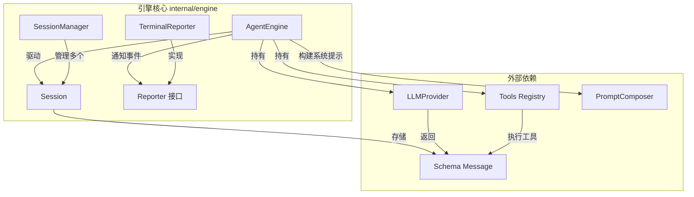
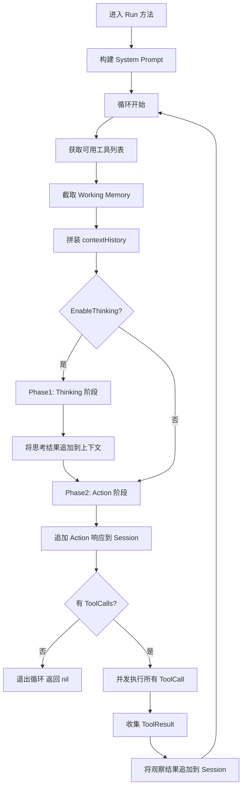
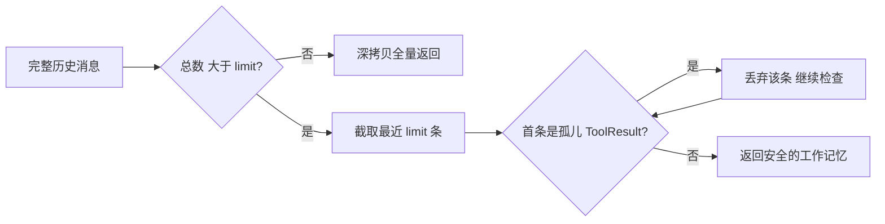
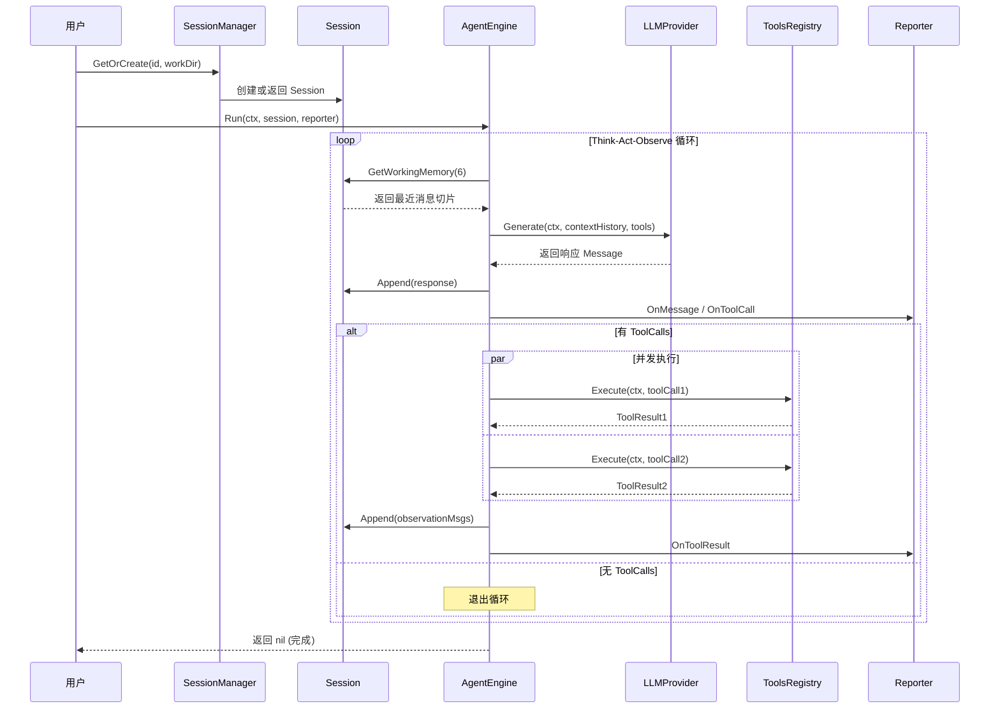

# 引擎核心

## 模块简介

引擎核心（`internal/engine`）是 go-my-harness AI Agent 框架的心脏模块。它实现了 Agent 的主运行循环——**思考(Think) → 行动(Act) → 观察(Observe)** 循环，并负责会话管理、工作记忆截取、工具并发执行以及事件报告。该模块将 LLM 提供者、工具注册表和会话状态有机地编排在一起，驱动 Agent 从接收用户输入到完成复杂多步骤任务的全过程。

核心职责包括：

- **Agent 主循环**：驱动 Thinking + Action 双阶段推理，支持慢思考模式
- **工作记忆管理**：对会话历史进行滑动窗口截取，控制上下文长度，并处理孤儿 [ToolResult](../internal/schema/message.go) 的兼容性问题
- **会话隔离与管理**：通过 [SessionManager](../internal/engine/session.go) 实现多会话物理隔离，支持并发安全
- **事件报告机制**：通过 [Reporter](../internal/engine/reporter.go) 接口抽象生命周期事件，支持终端、Web 等多种输出
- **工具并发执行**：对 LLM 返回的多个 [ToolCall](../internal/schema/message.go) 使用 goroutine 并发执行

## 架构总览



## 核心组件详解

### 1. [AgentEngine](../internal/engine/loop.go) — Agent 引擎

`AgentEngine` 是框架的核心执行引擎，负责编排整个 Agent 运行循环。

```go
type AgentEngine struct {
    provider       provider.LLMProvider // LLM 提供者，负责模型推理
    registry       tools.Registry       // 工具注册表，提供可用工具列表与执行能力
    EnableThinking bool                 // 慢思考模式开关，开启后在 Action 前增加 Thinking 阶段
}
```

**构造函数：**

```go
func NewAgentEngine(p provider.LLMProvider, r tools.Registry, enableThinking bool) *AgentEngine
```

[AgentEngine](../internal/engine/loop.go) 本身是**无状态**的——它不持有任何会话数据。每次调用 `Run` 方法时，它从外部接收一个 `Session` 对象，这使得同一个引擎实例可以为多个会话服务。

#### [AgentEngine](../internal/engine/loop.go).Run — 主运行循环

```go
func (e *AgentEngine) Run(ctx context.Context, session *Session, reporter Reporter) error
```

`Run` 方法是引擎的核心逻辑，实现了以下循环流程：



**关键设计决策：**

1. **双阶段推理**：当 `EnableThinking=true` 时，引擎先调用 LLM 进行「慢思考」（不传工具），让模型自由推理；再进入 Action 阶段（传工具），让模型做出决策。这模拟了人类「先想后做」的认知模式。

2. **Working Memory 截取**：每次循环都只取最近 6 条消息（`session.GetWorkingMemory(6)`），而非全量历史。这控制了 Token 消耗，同时模拟了人类的短期工作记忆。

3. **工具并发执行**：LLM 可能在一次响应中返回多个 [ToolCall](../internal/schema/message.go)，引擎使用 `sync.WaitGroup` 和 goroutine 并发执行所有工具调用，显著提升执行效率。

4. **System Prompt 动态构建**：每次 `Run` 被调用时，引擎通过 `PromptComposer` 根据 [Session](../internal/engine/session.go) 绑定的工作区路径动态构建系统提示。

### 2. [Session](../internal/engine/session.go) — 会话

`Session` 代表一次完整的对话会话，存储所有历史消息并提供工作记忆截取能力。

```go
type Session struct {
    ID        string         // 会话唯一标识
    WorkDir   string         // 绑定的物理工作区路径
    CreatedAt time.Time      // 创建时间
    UpdatedAt time.Time      // 最后更新时间
    history   []schema.Message // 完整消息历史（私有字段）
    mu        sync.RWMutex   // 读写锁，保证并发安全
}
```

**构造函数：**

```go
func NewSession(id string, workDir string) *Session
```

#### [Session](../internal/engine/session.go).Append — 追加消息

```go
func (s *Session) Append(msgs ...schema.Message)
```

线程安全地向会话历史追加一条或多条消息，同时更新 `UpdatedAt` 时间戳。代码中预留了持久化接口（`SaveToDisk()`），在生产环境中可将历史以 JSONL 格式写入磁盘。

#### [Session](../internal/engine/session.go).GetWorkingMemory — 获取工作记忆

```go
func (s *Session) GetWorkingMemory(limit int) []schema.Message
```

这是 [Session](../internal/engine/session.go) 中最精妙的方法，实现了**滑动窗口式工作记忆**：

1. **全量返回**：当历史总量 ≤ limit 或 limit ≤ 0 时，深拷贝全部历史并返回
2. **窗口截取**：截取最近 `limit` 条消息
3. **孤儿 [ToolResult](../internal/schema/message.go) 清除**：如果截取后的第一条消息是一个 [ToolResult](../internal/schema/message.go)（`Role == RoleUser && ToolCallID != ""`），但其对应的 [ToolCall](../internal/schema/message.go) 已被截断丢弃，则将其移除——防止大模型 API 因上下文不连续而返回 400 错误



**设计意图**：大模型 API 要求 [ToolCall](../internal/schema/message.go) 和 [ToolResult](../internal/schema/message.go) 必须在历史消息中成对出现。截断时如果首条恰好是孤立的 [ToolResult](../internal/schema/message.go)（其对应的 [ToolCall](../internal/schema/message.go) 已被截断），API 会报 `400 Bad Request`。这个「驾驭防线」确保了截取后的消息序列始终满足 API 的连续性约束。

### 3. [SessionManager](../internal/engine/session.go) — 会话管理器

`SessionManager` 负责管理多个 [Session](../internal/engine/session.go) 实例的生命周期，实现多会话的隔离管理。

```go
type SessionManager struct {
    sessions map[string]*Session // ID → Session 映射
    mu       sync.RWMutex       // 读写锁
}
```

#### [SessionManager](../internal/engine/session.go).GetOrCreate — 获取或创建会话

```go
func (sm *SessionManager) GetOrCreate(id string, workDir string) *Session
```

- 如果指定 ID 的 [Session](../internal/engine/session.go) 已存在，直接返回（幂等性保证）
- 如果不存在，创建新 [Session](../internal/engine/session.go) 并注册到管理器中
- 通过 `sync.RWMutex` 保证并发安全

**会话隔离**：不同 [Session](../internal/engine/session.go) 之间的消息历史完全独立。即使两个会话由同一个 [AgentEngine](../internal/engine/loop.go) 驱动，它们的工作记忆也互不可见——这在测试 `TestSessionPhysicalIsolation` 中得到了验证。

### 4. [Reporter](../internal/engine/reporter.go) — 事件报告接口

`Reporter` 是一个观察者模式的接口，定义了 Agent 运行生命周期中的四类事件：

```go
type Reporter interface {
    OnThinking(ctx context.Context)                                  // 模型开始慢思考
    OnToolCall(ctx context.Context, toolName string, args string)    // 模型发起工具调用
    OnToolResult(ctx context.Context, toolName string, result string, isError bool) // 工具执行完成
    OnMessage(ctx context.Context, content string)                   // 模型输出最终回答
}
```

通过接口抽象，引擎核心与具体的输出方式解耦。可以实现终端输出、Web UI 推送、日志记录等多种 [Reporter](../internal/engine/reporter.go)。

### 5. [TerminalReporter](../internal/engine/terminal_repoter.go) — 终端报告器

`TerminalReporter` 是 `Reporter` 接口的终端实现，使用带图标的格式化输出提供直观的运行时反馈：

```go
type TerminalReporter struct{}

func NewTerminalReporter() *TerminalReporter
```

| 方法 | 输出示例 | 说明 |
|------|---------|------|
| `OnThinking` | `[🤔 思考中] 模型正在推理...` | 进入 Thinking 阶段 |
| `OnToolCall` | `[🛠️ 调用工具] bash` + 参数（截断至150字符） | 工具调用发起 |
| `OnToolResult` | `[✅ 执行成功] bash` 或 `[❌ 执行失败] bash` | 工具执行结果 |
| `OnMessage` | `🤖 Agent 回复: ...` | 最终回答输出 |

[TerminalReporter](../internal/engine/terminal_repoter.go) 对过长的参数和结果进行了截断处理（参数 > 150 字符，引擎层结果 > 200 字符），保持终端输出的可读性。

### 6. Schema 数据类型

引擎核心依赖 `internal/schema/message.go` 中定义的数据类型来描述消息流：

#### [Message](../internal/schema/message.go) — 消息

```go
type Message struct {
    Role       Role       `json:"role"`
    Content    string     `json:"content"`
    ToolCalls  []ToolCall `json:"tool_calls,omitempty"`   // 模型发起的工具调用
    ToolCallID string     `json:"tool_call_id,omitempty"` // 关联的工具调用 ID
}
```

`Message` 是整个框架的通用消息单元。当模型决定调用工具时，`ToolCalls` 字段被填充；当这是对工具结果的响应时，`ToolCallID` 被填充以维持上下文关联。

#### [ToolCall](../internal/schema/message.go) — 工具调用请求

```go
type ToolCall struct {
    ID        string          `json:"id"`
    Name      string          `json:"name"`
    Arguments json.RawMessage `json:"arguments"` // 延迟解析，由具体工具负责
}
```

使用 `json.RawMessage` 存放参数，实现了**延迟解析**——引擎层不需要理解每个工具的参数格式，解析责任下放给具体的工具实现。

#### [ToolResult](../internal/schema/message.go) — 工具执行结果

```go
type ToolResult struct {
    ToolCallID string `json:"tool_call_id"`
    Output     string `json:"output"`
    IsError    bool   `json:"is_error"` // 标记是否失败，用于错误自愈
}
```

#### [ToolDefinition](../internal/schema/message.go) — 工具定义

```go
type ToolDefinition struct {
    Name        string      `json:"name"`
    Description string      `json:"description"`
    InputSchema interface{} `json:"input_schema"` // JSON Schema 格式
}
```

## 数据流

以下展示了一次完整的 Agent 运行过程中，数据在各组件之间的流转：



## 关键设计模式

### 并发安全

引擎核心全面考虑了并发场景：

- **[Session](../internal/engine/session.go)**：使用 `sync.RWMutex` 保护 `history` 字段，`Append` 获取写锁，`GetWorkingMemory` 获取读锁
- **[SessionManager](../internal/engine/session.go)**：使用 `sync.RWMutex` 保护 `sessions` 映射
- **工具执行**：使用 `sync.WaitGroup` 协调多个 goroutine 的并发工具执行
- **深拷贝返回**：`GetWorkingMemory` 使用 `copy()` 深拷贝切片，防止外部修改内部状态

测试 `TestSessionConcurrentSafety` 验证了 20 个 goroutine（10 写 + 10 读）并发操作下的数据一致性。

### 工作记忆与遗忘机制

Working Memory 的滑动窗口机制模拟了人类的短期记忆特性：

- 最近的对话信息优先保留
- 过期的信息自然「遗忘」——被截断丢弃
- 测试 `TestWorkingMemoryForgetting` 验证了早期敏感信息（如密钥）在足够多新消息后会被正确遗忘

### 孤儿 [ToolResult](../internal/schema/message.go) 防御

这是引擎核心中最关键的兼容性处理。大模型 API（如 OpenAI、Anthropic）要求 [ToolCall](../internal/schema/message.go) 和 [ToolResult](../internal/schema/message.go) 必须在消息序列中成对出现。当 Working Memory 截取恰好将一个 [ToolResult](../internal/schema/message.go) 与对应的 [ToolCall](../internal/schema/message.go) 分离时，API 会直接报错。`GetWorkingMemory` 通过检测切片首条消息的 `ToolCallID` 字段，主动丢弃「孤儿」[ToolResult](../internal/schema/message.go)，确保 API 调用安全。

## 与其他模块的关系

| 依赖模块 | 关系说明 |
|---------|----------|
| [LLM 提供者](LLM提供者.md) | `AgentEngine` 通过 `provider.LLMProvider` 接口调用大模型推理 |
| [工具系统](工具系统.md) | `AgentEngine` 通过 `tools.Registry` 获取可用工具列表并执行工具 |
| Schema 定义 | 引擎使用 `schema.Message`、`schema.ToolCall` 等类型作为通用数据单元（定义在本模块内） |
| [上下文管理](上下文管理.md) | `AgentEngine.Run` 使用 `PromptComposer` 动态构建系统提示 |

## 测试覆盖

引擎核心通过 7 个测试用例覆盖了关键场景：

| 测试 | 验证点 |
|------|-------|
| `TestGetWorkingMemory_FullReturn` | 历史 ≤ limit 时全量返回且顺序正确 |
| `TestGetWorkingMemory_Truncation` | 滑动窗口截取范围正确 |
| `TestGetWorkingMemory_OrphanToolResult` | 孤儿 [ToolResult](../internal/schema/message.go) 被正确丢弃 |
| `TestSessionPhysicalIsolation` | 不同 [Session](../internal/engine/session.go) 之间消息完全隔离 |
| `TestWorkingMemoryForgetting` | 早期敏感信息在截断后被遗忘 |
| `TestSessionConcurrentSafety` | 20 goroutine 并发读写无 Data Race |
| `TestSessionManagerGetOrCreate` | 同 ID 返回同实例，不同 ID 返回不同实例 |


<!-- crosslinks (auto-generated) -->
## Related Modules
- Depends on: [LLM提供者](llm提供者.md), [上下文管理](上下文管理.md), [工具系统](工具系统.md)
- Used by: [应用入口](应用入口.md), [飞书集成](飞书集成.md)
