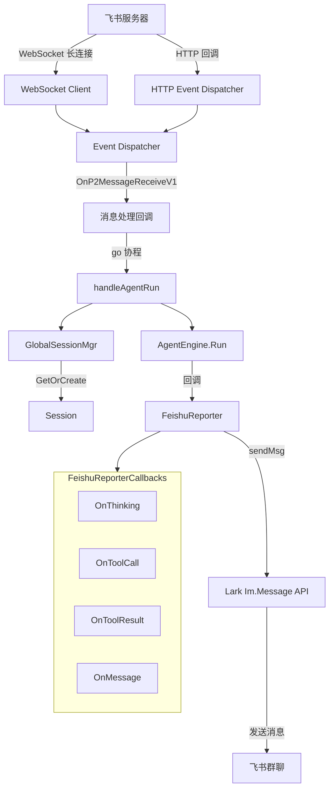
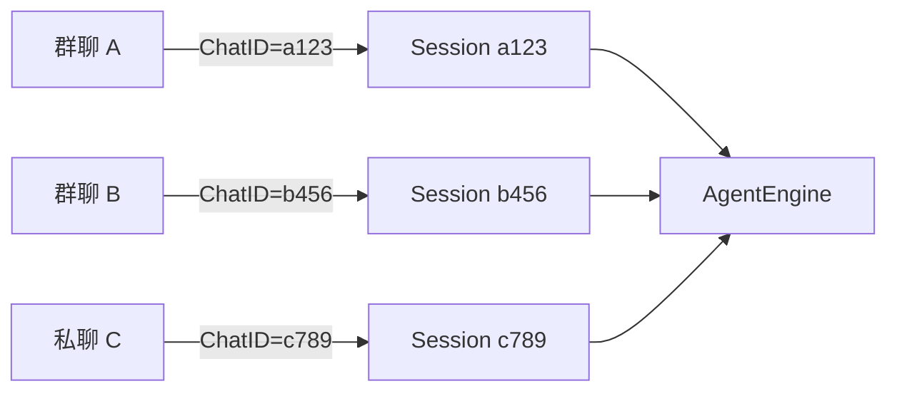
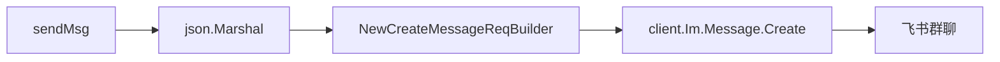
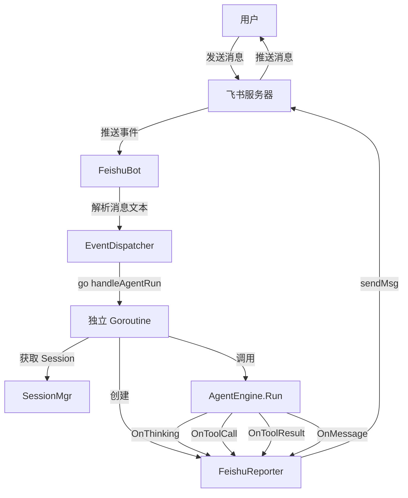

# 飞书集成模块

## 模块简介

飞书集成模块（`internal/feishu/bot.go`）是 go-my-harness 项目中负责与飞书（Lark）平台对接的核心适配层。该模块将飞书机器人接收到的用户消息桥接到内部的 AI Agent 引擎，并将 Agent 的思考过程、工具调用和最终回答实时反馈到飞书会话中。

模块围绕两个核心结构体构建：

- **[FeishuBot](../internal/feishu/bot.go)** — 飞书机器人主体，负责连接管理、事件分发和 Agent 任务调度。
- **[FeishuReporter](../internal/feishu/bot.go)** — 飞书消息回报器，实现 Agent 运行过程中的事件回调接口，将各阶段状态推送回飞书群聊。

## 核心功能

| 功能 | 说明 |
|------|------|
| WebSocket 长连接 | 通过飞书 SDK 的 WebSocket 客户端建立长连接，支持自动重连 |
| HTTP 事件分发 | 提供 HTTP 回调模式的事件调度器，兼容传统部署方式 |
| 消息接收与解析 | 监听飞书 `im.message.receive_v1` 事件，提取纯文本消息内容 |
| 并发 Agent 调度 | 每条消息独立开启 Goroutine 运行 Agent，不阻塞事件回调 |
| 会话物理隔离 | 以飞书 ChatID 作为 SessionID，不同群聊各自维护独立会话 |
| 实时状态回报 | 在 Agent 思考、工具调用、工具结果、最终回答等阶段向飞书推送消息 |

## 架构图



## 组件详解

### [FeishuBot](../internal/feishu/bot.go) 结构体

`FeishuBot` 是飞书集成模块的入口结构体，封装了与飞书平台通信所需的全部依赖。

```go
type FeishuBot struct {
    client      *lark.Client         // 飞书官方 SDK 客户端
    appID       string               // 飞书应用 App ID
    appSecret   string               // 飞书应用 App Secret
    encryptKey  string               // 事件加密密钥（HTTP 模式使用）
    verifyToken string               // 事件验证令牌（HTTP 模式使用）
    engine      *engine.AgentEngine  // 核心 Agent 引擎引用
    workDir     string               // 工作区物理路径，用于创建 Session
}
```

**字段说明：**

| 字段 | 类型 | 用途 |
|------|------|------|
| `client` | `*lark.Client` | 飞书 SDK 客户端实例，用于调用飞书 OpenAPI（如发送消息） |
| `appID` | `string` | 飞书开放平台应用的唯一标识 |
| `appSecret` | `string` | 飞书应用密钥，用于鉴权 |
| `encryptKey` | `string` | 事件订阅的加密密钥，仅在 HTTP 回调模式下使用 |
| `verifyToken` | `string` | 事件订阅的验证令牌，仅在 HTTP 回调模式下使用 |
| `engine` | `*engine.AgentEngine` | 指向 [引擎核心](引擎核心.md) 的引用，负责实际推理执行 |
| `workDir` | `string` | 工作区目录路径，传递给 [Session](../internal/engine/session.go) 用于文件操作 |

---

### NewFeishuBot

构造函数，创建并初始化一个 `FeishuBot` 实例。

```go
func NewFeishuBot(eng *engine.AgentEngine, cfg *provider.FeishuConfig, workDir string) *FeishuBot
```

**行为说明：**

1. **参数校验**：检查 `cfg.AppID` 和 `cfg.AppSecret` 是否为空，为空则调用 `log.Fatal` 终止程序并提示用户配置 `config.json`。
2. **创建 SDK 客户端**：调用 `lark.NewClient(appID, appSecret)` 实例化飞书官方客户端。
3. **组装返回**：将所有配置字段和引擎引用封装到 `FeishuBot` 中返回。

**参数说明：**

| 参数 | 说明 |
|------|------|
| `eng` | [引擎核心](引擎核心.md) 实例，提供 `Run` 方法驱动 Agent 执行 |
| `cfg` | 飞书配置对象，包含 AppID、AppSecret、EncryptKey、VerifyToken |
| `workDir` | 工作区物理路径 |

---

### StartWebSocket

启动 WebSocket 长连接模式，与飞书服务器建立持久连接。

```go
func (b *FeishuBot) StartWebSocket(ctx context.Context) error
```

**行为说明：**

1. 调用 `createEventDispatcher("", "")` 创建事件调度器（长连接模式下无需 `verifyToken` 和 `encryptKey`）。
2. 使用飞书 WebSocket SDK 创建客户端，配置：
   - `ws.WithEventHandler(eventHandler)` — 绑定事件处理器
   - `ws.WithLogLevel(larkcore.LogLevelInfo)` — 设置日志级别
   - `ws.WithAutoReconnect(true)` — 开启自动重连
3. 调用 `wsClient.Start(ctx)` 启动长连接（阻塞式调用，直到连接断开或 context 取消）。

**设计要点：**

- WebSocket 模式是推荐的连接方式，无需公网暴露，安全性更高。
- 自动重连机制确保网络波动后能自动恢复连接。
- `context.Context` 参数支持优雅关闭。

---

### GetEventDispatcher

获取 HTTP 回调模式的事件调度器。

```go
func (b *FeishuBot) GetEventDispatcher() *dispatcher.EventDispatcher
```

**行为说明：**

- 调用 `createEventDispatcher(b.verifyToken, b.encryptKey)` 创建带有验证令牌和加密密钥的事件调度器。
- 返回的调度器可直接注册到 HTTP 服务器中处理飞书回调请求。

**适用场景：** 传统 HTTP 回调部署模式，需要公网可访问的 HTTPS 端点。

---

### createEventDispatcher

内部方法，构建飞书事件调度器并注册事件处理回调。

```go
func (b *FeishuBot) createEventDispatcher(verifyToken, encryptKey string) *dispatcher.EventDispatcher
```

**注册的事件处理：**

| 事件 | 处理逻辑 |
|------|----------|
| `OnP2MessageReceiveV1` | 接收消息事件：从 JSON 消息体中提取纯文本内容，获取 ChatID，然后开启独立 Goroutine 调用 `handleAgentRun` |
| `OnP2MessageReadV1` | 消息已读事件：静默返回 `nil`，避免日志干扰 |

**消息解析逻辑：**

飞书消息体格式为 `{"text":"用户输入内容"}`，该方法通过简单的字符串前后缀裁剪提取纯文本：

```go
contentStr := *event.Event.Message.Content
contentStr = strings.TrimPrefix(contentStr, `{"text":"`)
contentStr = strings.TrimSuffix(contentStr, `"}`)
```

**并发设计：**

```go
go b.handleAgentRun(chatId, contentStr)
```

每条消息收到后立即启动独立 Goroutine 处理，确保事件回调不被阻塞。这是驾驭并发的关键设计——飞书 SDK 的事件回调是同步的，如果在此处等待 Agent 运行完毕，将导致后续事件积压。

---

### handleAgentRun

核心业务方法，驱动 Agent 引擎处理用户消息。

```go
func (b *FeishuBot) handleAgentRun(chatId string, prompt string)
```

**行为说明：**

1. **创建回报器**：为当前聊天窗口实例化专属的 `FeishuReporter`，绑定 `client` 和 `chatId`。
2. **获取/创建会话**：调用 `engine.GlobalSessionMgr.GetOrCreate(chatId, b.workDir)`，以飞书 ChatID 作为 SessionID。不同群聊的消息各自进入独立的 [会话](引擎核心.md)，互不干扰。
3. **追加用户消息**：将用户输入作为 `RoleUser` 消息追加到会话历史。
4. **启动引擎**：调用 `b.engine.Run(ctx, session, reporter)` 驱动 Agent 执行，将 `reporter` 传入以接收各阶段回调。
5. **错误处理**：如果引擎运行崩溃，通过 `reporter.sendMsg` 向飞书群聊发送错误通知。

**会话隔离策略：**



每个飞书会话（群聊或私聊）拥有唯一的 ChatID，模块直接将其用作 SessionID，实现了天然的会话物理隔离。多个会话共享同一个 [AgentEngine](../internal/engine/loop.go) 实例，但各自的对话历史和工作区完全独立。

---

### [FeishuReporter](../internal/feishu/bot.go) 结构体

`FeishuReporter` 实现了 Agent 运行过程中的事件回调接口，负责将 Agent 各阶段的状态实时推送到飞书群聊。

```go
type FeishuReporter struct {
    client *lark.Client  // 飞书 SDK 客户端，用于发送消息
    chatId string        // 目标飞书会话 ID
}
```

**设计职责：**

`FeishuReporter` 是 [引擎核心](引擎核心.md) 与飞书群聊之间的桥梁。Agent 引擎在运行过程中会在不同阶段调用 [Reporter](../internal/engine/reporter.go) 的回调方法，[Reporter](../internal/engine/reporter.go) 将这些事件转化为飞书消息推送给用户，实现"所见即所得"的交互体验。

---

### sendMsg

内部方法，向飞书群聊发送一条纯文本消息。

```go
func (r *FeishuReporter) sendMsg(text string)
```

**行为说明：**

1. 构建 `{"text": "..."}` 格式的 JSON 消息体。
2. 使用飞书 SDK 的 `Im.Message.Create` API，以 `ChatId` 作为接收者标识发送消息。
3. 消息类型为 `MsgTypeText`（纯文本）。

**调用链：**



---

### OnThinking

Agent 思考阶段的回调。

```go
func (r *FeishuReporter) OnThinking(ctx context.Context)
```

**行为：** 发送轻量级提示消息 `"🤔 模型正在慢思考 (Thinking)..."`，告知用户 Agent 正在处理中。采用简洁提示避免飞书消息刷屏。

---

### OnToolCall

工具调用开始时的回调。

```go
func (r *FeishuReporter) OnToolCall(ctx context.Context, toolName string, args string)
```

**行为：** 发送消息通知用户即将执行的工具名称及其参数，格式示例：

```
🛠️ 正在执行工具：search_code
参数：{"query": "main.go"}
```

---

### OnToolResult

工具调用完成后的回调。

```go
func (r *FeishuReporter) OnToolResult(ctx context.Context, toolName string, result string, isError bool)
```

**行为：** 根据 `isError` 标志区分处理：

- **成功** (`isError = false`)：发送简洁的成功确认 `"✅ 执行成功 (工具名)"`，不回传完整结果内容，避免消息过长。
- **失败** (`isError = true`)：发送错误详情 `"⚠️ 执行报错 (工具名)：\n结果内容"`，帮助用户了解失败原因。

---

### OnMessage

Agent 最终回答的回调。

```go
func (r *FeishuReporter) OnMessage(ctx context.Context, content string)
```

**行为：** 将模型的最终纯文本回答直接发送到飞书群聊。这是用户在对话中最关注的核心输出。

## 消息处理完整流程

以下流程图展示了一条用户消息从飞书发出到 Agent 回复的完整链路：



## 连接模式对比

| 特性 | WebSocket 长连接 | HTTP 回调 |
|------|-----------------|-----------|
| 入口方法 | `StartWebSocket(ctx)` | `GetEventDispatcher()` |
| 网络要求 | 无需公网 IP | 需要公网 HTTPS 端点 |
| 安全性 | 更高（出站连接） | 需配合 `encryptKey` 和 `verifyToken` |
| 自动重连 | SDK 内置支持 | 无（依赖 HTTP 服务器） |
| 适用场景 | 开发调试、内网部署 | 生产环境传统部署 |

## 与其他模块的关系

- **[引擎核心](引擎核心.md)**：`FeishuBot` 持有 `AgentEngine` 的引用，通过 `engine.Run()` 驱动 Agent 执行推理。
- **[引擎核心](引擎核心.md)**：通过 `engine.GlobalSessionMgr` 管理会话生命周期，以飞书 ChatID 实现会话隔离。
- **[LLM提供者](LLM提供者.md)**：从 `provider.FeishuConfig` 读取飞书应用的 AppID、AppSecret 等配置项。
- **[引擎核心](引擎核心.md)**：使用 `schema.Message` 结构体封装用户消息，通过 `RoleUser` 标识消息角色。

## 设计决策与注意事项

### 并发安全

`handleAgentRun` 在独立 Goroutine 中运行，这意味着同一个群聊的多条消息会并发执行。当前实现中 `GlobalSessionMgr.GetOrCreate` 保证了同一 ChatID 的 [Session](../internal/engine/session.go) 唯一性，但并发写入 [Session](../internal/engine/session.go) 的消息历史可能存在竞态条件，需在上层 [Session](../internal/engine/session.go) 实现中保证线程安全。

### 消息解析简化

当前对飞书消息体的解析采用了简单的字符串裁剪方式（`TrimPrefix` / `TrimSuffix`），仅支持纯文本消息。对于富文本、图片、@提及等复杂消息类型，该解析方式可能不够健壮，后续可考虑引入完整的 JSON 反序列化。

### 错误容忍

`sendMsg` 方法忽略了 API 调用的返回错误（`_, _ = r.client.Im.Message.Create(...)`），这确保了消息发送失败不会导致 Agent 运行中断。但在生产环境中，建议增加错误日志记录或重试机制。


<!-- crosslinks (auto-generated) -->
## Related Modules
- Depends on: [上下文管理](上下文管理.md), [引擎核心](引擎核心.md)
